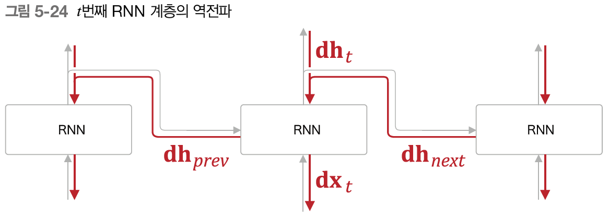
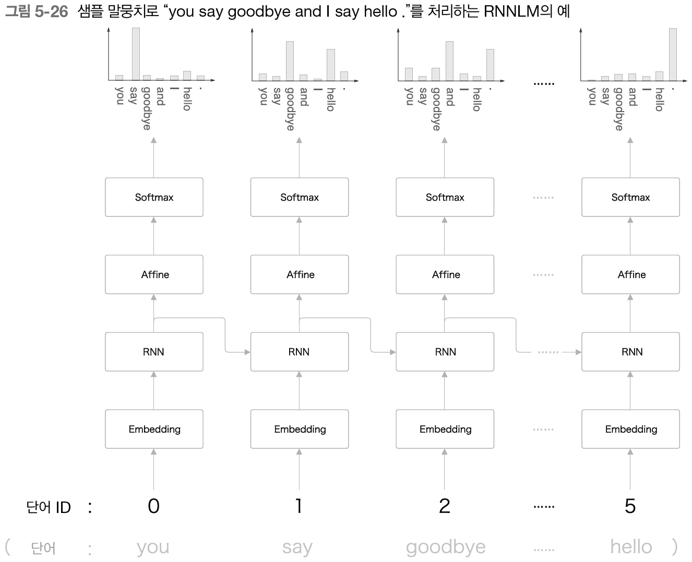

## 5.1 확률과 언어 모델

**1) word2vec**

- CBOW: 맥락으로부터 타깃 추측
- $P(w_t|w_{t-2}, w_{t-3})$ 이 실용적인 쓰임을 가질 수 있을까?

**2) 언어 모델(Language Model)**

- 언어 모델이란?
    
    특정한 단어의 시퀀스에 대해서, 그 시퀀스가 일어날 가능성이 어느 정도인지 확률로 평가하는 것  ex. 'you say goodbye': 0.092 | 'you say good die': 0.000000002
    
- 곱셈정리로부터 확률 유도
    
    동시 확률  = 사후 확률의 총곱
    
- '사후 확률': 타겟 단어보다 왼쪽에 등장하는 모든 단어를 맥락으로 했을 때의 확률

**3) CBOW**

- CBOW의 문제점
    
    i. 고려할 왼쪽 단어를 10개라고 가정해도, 그 이전에 등장하는 단어는 고려하지 못함.
    
    ex. Tom was watching TV in his room. Mary came into the room. Mary said hi to __    →    이 경우에는 10개 이전에 등장하는 Tom에 대한 정보는 알 수 x
    
    ii. 맥락 내 단어 순서 무시
    
    학습 과정에서, input layer 각각이 이전 단어를 뜻함 → hidden layer를 학습할 때는 단어 벡터들이 더해짐 → 단어 순서 무시
    
    → 그렇다면 concat을 하면 되지 않을까? → 그만큼 weight와 parameter가 증가해 효율 하락
    
- RNN 등장
    
    맥락이 아무리 길더라도 그 정보를 기억할 수 있는 매커니즘
    
    word2vec은 단어의 수치 표현을 얻기 위한 목적 → 언어 모델로는 드뭄
    
    사실 RNN 이후 word2vec이 등장했는데, 이는 RNN이 수치 표현을 할 수 있기는 하지만, 어휘 수 증가에 따른 대응 개선을 위해 word2vec이 고안된 것!
    
    ---
    

## 5.2 RNN이란?

**1) 순환하는 신경망**

- 데이터가 순환되면서 과거의 정보를 기억하는 동시에 최신 데이터로 갱신
- 입력 $(x_0, x_1, ... , x_t, ...)$ : 시각 t에서의 단어 벡터 or t번째 단어
- 출력 $(h_0, h_1, ... ,h_t, ...)$
- 2개의 출력으로 분기되어 하나는 자기 자신에게 입력, 하나는 같은 것이 복제되어 순환


**2) 순환 구조** 

$$
h_t = tanh(h_{t-1}W_h + x_tW_x + b)
$$

- RNN은 2개의 Weight를 가진다. → $W_x, W_h$
- $W_x:$ 입력 x를 출력 h로 변환하기 위한 가중치
- $W_h :$ 1개의 출력을 다음 시점의 출력으로 변환하기 위한 가중치
- $h_{t-1}$과 $x_t$는 행벡터
- 현재의 출력은 이전 출력에 기초해 계산됨  →  $h :$ 상태를 가지는 계층(hidden state)  →  '상태'를 기억해 시점이 1 단위 진행될 때마다 갱신됨

**3) BPTT**

- BPTT란?
    
    일반적인 backpropagation 적용 가능 → 시간 방향으로 펼친 신경망의 오차역전파법
    
- BPTT의 문제점
    
    긴 시계열 데이터에서 길이가 길어질수록 필요한 자원 증가 + 불안정한 기울기
    

**4) Truncated BPTT**

- 큰 시계열 데이터를 취급할 때, 적당한 길이로 끊음 → 작은 신경망 여러 개로 재탄생 : Truncated BPTT
- 순전파는 유지한 채, 역전파의 연결만 끊음   ex.  1000개의 말뭉치에서 10개 단위로 자름  →  데이터의 '순서'를 유지한 채 입력해야 함 (이전 미니배치에서는 무작위로 샘플링)

**5) Truncated BPTT의 미니배치 학습**

- 미니배치로 학습할 때는, 배치에 따라 시작점을 정해줘야함  ex. batch 1: 1~10 - 11~20  batch 2: 500~510 - 511~520

---

## 5.3 RNN 구현

**1) RNN 계층 구현**

- 행렬 형상 확인

$$
h_{t-1}W_h + x_tW_x = h_t
$$

- RNN

$h_{t-1} :$  N X H 

$W_h :$  H X H 

$x_t :$  N X D 

$W_x :$ D X H

*N: 미니배치 수, D: input vector의 차원 수, H: hidden state vector 차원 수*

```python
class RNN:
    def __init__(self, Wx, Wh, b):
        self.params = [Wx, Wh, b]       # 초기 parameter: 가중치 2개와 bias
        self.grads = [np.zeros_like(Wx), np.zeros_like(Wh), np.zeros_like(b)]     #기울기 초기화(각 parameter에 대응하는 형태로)
        self.cache = None    #역전파 계산 시 사용하는 중간 데이터 담기

    def forward(self, x, h_prev):
        Wx, Wh, b = self.params
        t = np.dot(h_prev, Wh) + np.dot(x, Wx) + b   #hidden state 계산
        h_next = np.tanh(t)  

        self.cache = (x, h_prev, h_next)
        return h_next

    def backward(self, dh_next):
        Wx, Wh, b = self.params
        x, h_prev, h_next = self.cache

        dt = dh_next * (1 - h_next ** 2)
        db = np.sum(dt, axis=0)
        dWh = np.dot(h_prev.T, dt)
        dh_prev = np.dot(dt, Wh.T)
        dWx = np.dot(x.T, dt)
        dx = np.dot(dt, Wx.T)

        self.grads[0][...] = dWx
        self.grads[1][...] = dWh
        self.grads[2][...] = db

        return dx, dh_prev
```

- TimeRNN
    
    T개의 RNN 계층으로 구성  →  T개 단계만큼의 작업을 한번에 처리하는 계층
    
    hidden state 'h'를 인스턴스 변수로 저장해 다음 시점으로 인계!  →  'stateful'이라는 인수로 받음
    
    ```python
    class TimeRNN:
        def __init__(self, Wx, Wh, b, stateful=False):
            self.params = [Wx, Wh, b]
            self.grads = [np.zeros_like(Wx), np.zeros_like(Wh), np.zeros_like(b)]
            self.layers = None
    
            self.h, self.dh = None, None    # h: 마지막 RNN 계층의 hidden state 인스턴스 변수로 저장    # dh: 한 개 앞 시점의 hidden state의 기울기 저장
            self.stateful = stateful        # if stateful == TRUE, hidden state 유지 -> 아무리 긴 시계열 데이터라도 forward 전파
    
        def forward(self, xs):     # xs: T개 분량의 시계열 데이터를 하나로 모은 입력
            Wx, Wh, b = self.params
            N, T, D = xs.shape    # N: 미니 배치 수 T: 시점 개수 D: 입력 벡터의 차원 수
            D, H = Wx.shape
    
            self.layers = []
            hs = np.empty((N, T, H), dtype='f')
    
            if not self.stateful or self.h is None:  # 이전 hidden state를 유지하지 않는다면 영행렬 할당
                self.h = np.zeros((N, H), dtype='f')   
            for t in range(T):
                layer = RNN(*self.params)   # RNN 계층 생성
                self.h = layer.forward(xs[:, t, :], self.h)   # 각 시각 t의 hidden state를 계산 -> 해당 시점의 값으로 할당   # forward(): 마지막 RNN 계층의 h가 저장됨
                hs[:, t, :] = self.h
                self.layers.append(layer)
    
            return hs
    ```
    
    - RNN 계층의 forward에서는 출력이 2개로 분기되므로, backward과정에서 이를 합산해 위 두 개의 기울기를 더함
        
        $dh_t :$  위로부터의 기울기
        
        $dh_{next} :$  한 시각 뒤(미래) 계층으로부터의 기울기
        
        
        
    
    ```python
        def backward(self, dhs):
            Wx, Wh, b = self.params
            N, T, H = dhs.shape
            D, H = Wx.shape
    
            dxs = np.empty((N, T, D), dtype='f')    # dx를 담을 공간
            dh = 0
            grads = [0, 0, 0]
            for t in reversed(range(T)):    # 시계열 데이터이므로 순서 반대로 지키기
                layer = self.layers[t]
                dx, dh = layer.backward(dhs[:, t, :] + dh)   # 각 시점의 기울기 dx를 구해 해당 인덱스에 저장   # 순전파에서 분리되었던 두 개의 출력 기울기 합산
                dxs[:, t, :] = dx
    
                for i, grad in enumerate(layer.grads):
                    grads[i] += grad
    
            for i, grad in enumerate(grads):
                self.grads[i][...] = grad
            self.dh = dh
    
            return dxs
    
    ```
    

---

## 5.4 시계열 데이터 처리 **계층 구현**

**1) RNNLM의 전체 그림**

- RNNLM: RNN을 사용한 언어 모델
- RNN 계층의 역할
    
    지금까지 입력된 단어를 '기억'하고, 다음에 출현할 단어를 '예측'
    
    과거의 정보를 인코딩해 저장할 수 있음
    
- Example - 'you say goodbye and I say hello.'
    
    
    
    RNN 계층은 'you say'라는 맥락을 기억하고 있음  → 이 과거 정보를 hidden state로 저장해두어 Affine계층과 다음 RNN계층에 전달
    

**2) Time 계층 구현**

- Embedding, RNN, Affine, Softmax  →  Time Embedding, Time RNN, Time Affine, Time Softmax
- 시계열 데이터를 한번에 처리하는 계층으로 구현
- Time Softmax의 경우, 미니배치 각각의 loss를 모두 더해 T(시점의 개수)로 나누어 평균 loss를 구함

---

## 5.5 **RNNLM 학습과 평가**

**1) RNNLM 구현**

- SimpleRNNLM
    
    ```python
    import sys
    sys.path.append('..')
    import numpy as np
    from common.time_layers import *
    
    class SimpleRnnlm:
        def __init__(self, vocab_size, wordvec_size, hidden_size):
            V, D, H = vocab_size, wordvec_size, hidden_size
            rn = np.random.randn
    
            # 가중치 초기화
            embed_W = (rn(V, D) / 100).astype('f')
            rnn_Wx = (rn(D, H) / np.sqrt(D)).astype('f')
            rnn_Wh = (rn(H, H) / np.sqrt(H)).astype('f')   #Xavier 초기값: 이전 계층의 노드가 n개라면 표준편차가 1/sqrt(n)인 분포를 초기값으로 사용
            rnn_b = np.zeros(H).astype('f')
            affine_W = (rn(H, V) / np.sqrt(H)).astype('f')   
            affine_b = np.zeros(V).astype('f')
    
            # 계층 생성
            self.layers = [
                TimeEmbedding(embed_W),
                TimeRNN(rnn_Wx, rnn_Wh, rnn_b, stateful=True),
                TimeAffine(affine_W, affine_b)
            ]
            self.loss_layer = TimeSoftmaxWithLoss()
            self.rnn_layer = self.layers[1]
    
            # 모든 가중치와 기울기를 리스트에 모은다.
            self.params, self.grads = [], []
            for layer in self.layers:
                self.params += layer.params
                self.grads += layer.grads
    
        def forward(self, xs, ts):
            for layer in self.layers:
                xs = layer.forward(xs)
            loss = self.loss_layer.forward(xs, ts)
            return loss
    
        def backward(self, dout=1):
            dout = self.loss_layer.backward(dout)
            for layer in reversed(self.layers):
                dout = layer.backward(dout)
            return dout
    
        def reset_state(self):
            self.rnn_layer.reset_state()
    ```
    

**2) 언어 모델의 평가**

- Perplexity(혼란도): 언어 모델의 성능을 평가하는 척도
- 혼란도 = 다음에 등장하는 단어 확률의 역수       ex.  you 다음 'say' 등장 확률 = 0.8  →  혼란도 = 1/0.8 = 1.25
- 혼란도가 1.25다?  →  다음에 등장할만한 단어의 후보가 1개 정도로 좁혀졌음
- 혼란도가 5다?  →  다음에 등장할만한 단어의 후보가 5개나 됨
- 즉, 혼란도가 낮을수록 좋은 언어 모델이라고 평가할 수 있음!
- 입력 데이터가 2개 이상일 경우, 마찬가지로 cross entropy error로 계산 →  e^L!

**3) RNNLM의 학습 코드**

- RNNLM - PTB 데이터셋 학습
    
    ```python
    import sys
    sys.path.append('..')
    import matplotlib.pyplot as plt
    import numpy as np
    from common.optimizer import SGD
    from dataset import ptb
    from simple_rnnlm import SimpleRnnlm
    
    # 하이퍼파라미터 설정
    batch_size = 10
    wordvec_size = 100
    hidden_size = 100 # RNN의 은닉 상태 벡터의 원소 수
    time_size = 5     # Truncated BPTT가 한 번에 펼치는 시간 크기
    lr = 0.1
    max_epoch = 100
    
    # 학습 데이터 읽기(전체 중 1000개만)
    corpus, word_to_id, id_to_word = ptb.load_data('train')
    corpus_size = 1000
    corpus = corpus[:corpus_size]
    vocab_size = int(max(corpus) + 1)
    
    xs = corpus[:-1]  # 입력
    ts = corpus[1:]   # 출력(정답 레이블)
    data_size = len(xs)
    print('말뭉치 크기: %d, 어휘 수: %d' % (corpus_size, vocab_size))
    
    # 학습 시 사용하는 변수
    max_iters = data_size // (batch_size * time_size)
    time_idx = 0
    total_loss = 0
    loss_count = 0
    ppl_list = []
    
    # 모델 생성
    model = SimpleRnnlm(vocab_size, wordvec_size, hidden_size)
    optimizer = SGD(lr)
    
    # 미니배치의 각 샘플의 읽기 시작 위치를 계산
    #Truncated BPTT
    jump = (corpus_size - 1) // batch_size
    offsets = [i * jump for i in range(batch_size)]    # offsets의 각 원소에 데이터를 읽는 시작 위치를 저장   # 각 미니배치에서 데이터를 읽는 시작 위치 조정
    
    for epoch in range(max_epoch):
        for iter in range(max_iters):
            # 미니배치 취득
            batch_x = np.empty((batch_size, time_size), dtype='i')
            batch_t = np.empty((batch_size, time_size), dtype='i')
            for t in range(time_size):         # 각 corpus의 미니배치에서 offset에 해당하는 위치의 데이터를 얻음
                for i, offset in enumerate(offsets):
                    batch_x[i, t] = xs[(offset + time_idx) % data_size]     # corpus보다 사이즈가 클 경우, 처음으로 돌아오게 하기 위해 나머지 이용
                    batch_t[i, t] = ts[(offset + time_idx) % data_size]
                time_idx += 1
    
            # 기울기를 구하여 매개변수 갱신
            loss = model.forward(batch_x, batch_t)
            model.backward()
            optimizer.update(model.params, model.grads)
            total_loss += loss
            loss_count += 1
    
        # 에폭마다 퍼플렉서티 평가
        ppl = np.exp(total_loss / loss_count)  # 입력 데이터 2개 이상일 경우, 총 손실/N -> e^L
        print('| 에폭 %d | 퍼플렉서티 %.2f'
              % (epoch+1, ppl))
        ppl_list.append(float(ppl))
        total_loss, loss_count = 0, 0
    ```
    

**4) RNNLM의 Trainer 클래스**

1. 미니배치를 순차적으로 구성 → 2. 모델의 forward와 backward 호출 → 3. Optimizer로 가중치 갱신 → 4. Perplexity를 통해 모델 평가