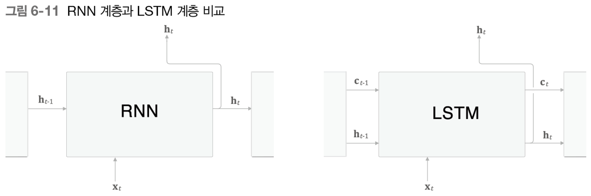
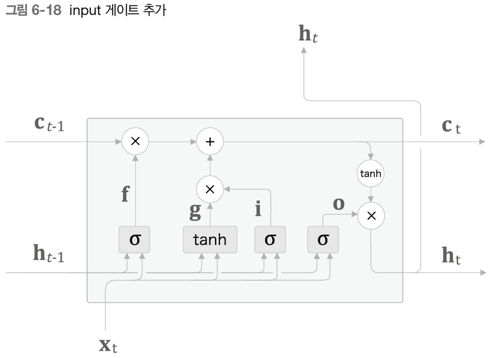

## 6.1 RNN의 문제점

**1) RNN**

- RNN: hidden state를 통해 과거 정보를 기억 및 저장
- 구조
    
    과거 정보 → 가중치1(matmul) + 새로운 입력 → 가중치2(matmul) + bias ⇒ tanh() = 현 시점 정보 → 출력이 2개로 분기
    

**2) 기울기 소실 또는 기울기 폭발**

- 언어 모델: 주어진 단어를 바탕으로 다음에 출현할 단어를 예측
- RNNLM
    
    RNN 계층을 통해 의미있는 기울기를 과거로 전달(정답 레이블을 학습할 때)
    
    이 과정을 통해 장기 의존 관계를 학습 → 기울기가 중간에 사그라들면 가중치는 갱신되지 않게 됨
    

**3) 기울기 소실과 기울기 폭발의 원인**

- RNN의 backward
    
    i. 시점 반대 방향으로 역전파가 진행될 때, tanh → + → matmul 순으로 연산을 통과함
    
    cf. 여기서 '+' 연산은 상류에서 전해지는 기울기를 그대로 하류로 통과시킴 (즉, 여기서 다뤄야할 연산은 tanh와 matmul)
    
    ii. tanh
    
    $y = tanh(x)$ 의 미분 = $1 - y^2$
    
    $1 - y^2$를 그래프로 그렸을 때, x가 0에서 멀어질수록 값이 작아짐 
    
    즉, tanh를 T번 통과하면, 기울기가 T번 작아짐
    
    iii. matmul
    
    역전파 과정에서 $matmul(d_h , W_h')$ 를 반복
    
    $W_h$를 T번 곱할 때마다 기울기의 크기가 지수적으로 감소하거나 증가 (가중치 초기값을 랜덤하게 설정하기 때문에 그에 따라 감소 또는 증가)
    

**4) 기울기 폭발 대책**

- 기울기 클리핑(gradients clipping)
    
    기울기의 L2 norm이 일정 threshold를 초과하면 기울기를 수정함
    

---

## 6.2 기울기 소실과 LSTM

**1) LSTM의 인터페이스**

- RNN 계층과 LSTM 계층 비교
    
    
    
    LSTM 계층에는 c라는 경로가 존재함! → memory cell: LSTM 전용의 기억 매커니즘
    
    c는 데이터를 자기 자신으로만 주고받음(다른 계층으로 출력x) + h는 RNN과 동일하게 두 개의 출력으로 분기
    
- RNN 등장
    
    맥락이 아무리 길더라도 그 정보를 기억할 수 있는 매커니즘
    
    word2vec은 단어의 수치 표현을 얻기 위한 목적 → 언어 모델로는 드뭄
    
    사실 RNN 이후 word2vec이 등장했는데, 이는 RNN이 수치 표현을 할 수 있기는 하지만, 어휘 수 증가에 따른 대응 개선을 위해 word2vec이 고안된 것!
    

**2) LSTM 계층 조립하기**

- c와 h의 관계
    
    c는 이전 시점의 c, 이전 시점의 h, 현재 시점의 x  3개 입력으로부터 '어떤 계산'을 수행
    
    이렇게 갱신된 t 시점의 c를 이용해 t시점의 hidden state를 계산! (tanh)
    
- 게이트
    
    열기/닫기를 조정하며 흐름을 제어 + 어느 정도의 열림 상태를 설정할지 제어함
    
    가중치 매개변수를 이용해 학습 데이터로부터 제어 상태를 갱신(0~1 사이의 실수)
    
    이 때, 출력값을 0~1 사이의 실수값으로 가지는 '시그모이드 함수' 사용!
    

**3) output 게이트**

- output gate: 다음 hidden state h의 출력을 담당하는 게이트
- $tanh(c_t)$에 게이트 적용하기
    
    $$
    o = sigmoid(x_tW_x^{(o)}+ h_{t-1}W_h^{(o)} + b^{(o)})
    $$
    
    위첨자 (o)는 output gate의 weight임을 의미
    
    입력 데이터 x와 이전 시점의 hidden state로부터 현 시점 hidden state 정보를 구하고, 얼만큼의 열림 상태를 흘려보낼까 계산(sigmoid로 0~1 사이의 실수 부여)
    
    즉, 각 원소에 대해 '그것이 다음 시각의 은닉 상태에 얼마나 중요한가'를 조정
    
    $$
    h_t = Hadamard(o, tanh(c_t))
    $$
    
    아다마르 곱을 통해 게이트 적용
    

**4) forget 게이트**

- forget gate: $c_{t-1}$의 기억 중에서 불필요한 기억을 잊게 해주는 게이트
    
    $$
    f = sigmoid(x_tW_x^{(f)}+ h_{t-1}W_h^{(f)} + b^{(f)})
    $$
    
    위첨자 (f)는 forget gate 전용의 weight임을 의미
    
    $$
    c_t = Hadamard(f, c_{t-1})
    $$
    
    forget gate와 이전 시점의 memory cell c의 아다마르 곱을 통해 적용
    

**5) 새로운 기억 셀**

-  new cell
    새로 기억해야 할 정보를 기억 셀에 추가
    
    tanh 노드로 계산 → 이전 시각의 기억 셀 $c_{t-1}$에 더해짐 → 기억 셀에 새로운 '정보' 추가
    
    $$
    g = tanh(x_tW_x^{(g)}+ h_{t-1}W_h^{(g)} + b^{(g)})
    $$
    
    '게이트'가 아니라 '정보'를 추가하는 작업이므로 tanh 함수 사용
    

**6) input gate**

- input gate: 새로 들어오는 정보 g에 대해서 그 가치를 판단 → 새 정보를 적절히 취사선택하는 기능
    
    $$
    i = tanh(x_tW_x^{(i)}+ h_{t-1}W_h^{(i)} + b^{(i)})
    $$
    
    input gate에 의해 가중된 정보가 새로 추가됨
    
    i와 g의 아다마르 곱 결과를 기억 셀에 추가
    
- 최종 계산 그래프
    
    
    

**7) LSTM의 기울기 흐름**

- LSTM에서는 어떤 원리로 기울기 소실을 막을까?
    
    i. RNN은 행렬 곱, LSTM은 아다마르 곱 
    
    매 시점마다 다른 게이트 값을 통해 아다마르 곱을 적용함 → 곱셈의 효과가 누적되지 X
    
    ii. '+'노드는 그대로 흘려보내기 때문에 기울기 변화 x, 그렇지 않은 'x'노드는 forget gate가 제어
    
    잊어야 한다고 판단한 memory cell의 원소는 기울기가 작아지고, 잊으면 안된다고 판단한 memory cell의 원소는 기울기가 약화되지 않은 채로 역전파
    

---

## 6.3 LSTM 구현

**1) 한 단계의 LSTM 구현**

- 최종 LSTM 수행 계산식
    
    $$
    c_t = Hadamard(f, c_{t-1}) + Hadamard(g, i)
    $$
    
    $$
    h_t = Hadamard(o, tanh(c_t))
    $$
    
- 모든 Affine Transformation 하나로 합치기
    
    f, g, i, o 4개 게이트(셀) 모두 Affine 변환으로 이루어짐 → 각 가중치를 concat시켜 하나의 큰 행렬로 만들자 → $W_x, W_h, b$
    
    4개를 합쳐 하나의 큰 행렬로 계산한 뒤, slice 노드를 통해 다시 4개로 나누어 게이트를 통과시킴
    
- 한 단계의 LSTM 구현
    
    forward() :
    
    ```python
    def forward(self, x, h_prev, c_prev):  # 이전 시점의 hidden state, 이전 시점의 memeory cell
            Wx, Wh, b = self.params
            N, H = h_prev.shape
    
            A = np.dot(x, Wx) + np.dot(h_prev, Wh) + b   # 4개 가중치 행렬이 모인 Affine
    
            f = A[:, :H]  # slice
            g = A[:, H:2*H]
            i = A[:, 2*H:3*H]
            o = A[:, 3*H:]
    
            f = sigmoid(f)
            g = np.tanh(g)
            i = sigmoid(i)
            o = sigmoid(o)
    
            c_next = f * c_prev + g * i   # 최종 아다마르 곱
            h_next = o * np.tanh(c_next)
    
            self.cache = (x, h_prev, c_prev, i, f, g, o, c_next)
            return h_next, c_next
    ```
    
    backward() : 4개로 slice된 행렬의 미분값이 다시 반대로 흘러올 때, np.hstack()을 통해 연결
    

**2) Time LSTM 구현**

- Time RNN과 유사한 형상 → 인수 stateful을 통해 이전 시점의 hidden state과 memory cell 유지 여부를 결정함

---

## 6.4 LSTM을 사용한 언어 모델

**1) LSTM 계층을 사용하는 RNNLM**

**2) PTB 데이터셋 학습**

```python
import sys
sys.path.append('..')
from common.optimizer import SGD
from common.trainer import RnnlmTrainer
from common.util import eval_perplexity
from dataset import ptb
from rnnlm import Rnnlm

# 하이퍼파라미터 설정
batch_size = 20
wordvec_size = 100
hidden_size = 100  # RNN의 은닉 상태 벡터의 원소 수
time_size = 35     # RNN을 펼치는 크기
lr = 20.0
max_epoch = 4
max_grad = 0.25

# 학습 데이터 읽기
corpus, word_to_id, id_to_word = ptb.load_data('train')
corpus_test, _, _ = ptb.load_data('test')
vocab_size = len(word_to_id)
xs = corpus[:-1]
ts = corpus[1:]

# 모델 생성
model = Rnnlm(vocab_size, wordvec_size, hidden_size) 
optimizer = SGD(lr)
trainer = RnnlmTrainer(model, optimizer)

# 기울기 클리핑을 적용하여 학습
trainer.fit(xs, ts, max_epoch, batch_size, time_size, max_grad,  # 4 epoch   # 모델의 기울기를 구해 매개변수 갱신
            eval_interval=20)   #데이터가 크므로 20번째 반복마다 perplexity 평가(모든 에폭에서 평가 x)
trainer.plot(ylim=(0, 500))

# 테스트 데이터로 평가
model.reset_state()  #LSTM의 hidden state와 memoery cell을 재설정
ppl_test = eval_perplexity(model, corpus_test)
print('테스트 퍼플렉서티: ', ppl_test)

# 매개변수 저장
model.save_params()   # 학습 완료된 매개변수 저장해 문장 생성에 사용
```

---

## 6.5 RNNLM 추가 개선

**1) LSTM 계층 다층화**

- LSTM 계층을 2단계 이상 쌓을 경우 더 좋은 효과를 가짐 → 데이터의 크기와 성질에 따라 몇 개 층으로 쌓을지는 하이퍼파라미터로!

**2) 드롭아웃에 의한 과적합 억제**

- Dropout: train 과정에서 랜덤으로 선택된 뉴런을 무시해 일종의 정규화 기능을 적용
- RNN 모델에서의 Dropout 계층 적용
    
    i) 시계열 방향으로 삽입: 시간이 흐르면서 정보가 사라질 위험
    
    ii) 상하방향으로 삽입: 시간 방향 진행에서 정보 손실 x
    
    iii) 변형 드롭아웃: 같은 계층에 속한 드롭아웃은 같은 마스크 공유 → 데이터의 통과or차단 동일하게 유지
    

**3) 가중치 공유**

- Embedding 계층의 가중치와 Affine 계층의 가중치를 공유
    
    가중치를 공유하면서 학습하는 과정에서 매개변수 수를 줄일 수 있음 → 학습하기 더 쉬워짐 + 과적합이 억제됨  
    
    Embedding 계층의 가중치 형상: ( V, H )
    
    Affine 계층의 가중치 형상: (H, V)
    
    V: 어휘 수, H: LSTM hidden state 차원 수 
    
    ⇒ 가중치 공유 시 transpose 시켜서 구현해야 함!
    

**4) 개선된 RNNLM 구현(RNN의 정규화)**

- 개선된 RNNLM
    
    ```python
    class BetterRnnlm(BaseModel):
    
        def __init__(self, vocab_size=10000, wordvec_size=650,
                     hidden_size=650, dropout_ratio=0.5):
            V, D, H = vocab_size, wordvec_size, hidden_size
            rn = np.random.randn
    
            embed_W = (rn(V, D) / 100).astype('f')
            lstm_Wx1 = (rn(D, 4 * H) / np.sqrt(D)).astype('f')
            lstm_Wh1 = (rn(H, 4 * H) / np.sqrt(H)).astype('f')
            lstm_b1 = np.zeros(4 * H).astype('f')
            lstm_Wx2 = (rn(H, 4 * H) / np.sqrt(H)).astype('f')
            lstm_Wh2 = (rn(H, 4 * H) / np.sqrt(H)).astype('f')
            lstm_b2 = np.zeros(4 * H).astype('f')
            affine_b = np.zeros(V).astype('f')
    
            self.layers = [
                TimeEmbedding(embed_W),
                TimeDropout(dropout_ratio),  # 드롭아웃 적용
                TimeLSTM(lstm_Wx1, lstm_Wh1, lstm_b1, stateful=True),   # 2개 단계의 LSTM 계층
                TimeDropout(dropout_ratio),
                TimeLSTM(lstm_Wx2, lstm_Wh2, lstm_b2, stateful=True),
                TimeDropout(dropout_ratio),
                TimeAffine(embed_W.T, affine_b)  # weight tying!!   # 전치를 적용한 가중치 공유
            ]
            self.loss_layer = TimeSoftmaxWithLoss()
            self.lstm_layers = [self.layers[2], self.layers[4]]
            self.drop_layers = [self.layers[1], self.layers[3], self.layers[5]]
    
            self.params, self.grads = [], []
            for layer in self.layers:
                self.params += layer.params
                self.grads += layer.grads
    ```
    
- 개선된 RNNLM을 이용한 train
    
    ```python
    import sys
    sys.path.append('..')
    from common import config
    # GPU에서 실행하려면 아래 주석을 해제하세요(CuPy 필요).
    # ==============================================
    # config.GPU = True
    # ==============================================
    from common.optimizer import SGD
    from common.trainer import RnnlmTrainer
    from common.util import eval_perplexity, to_gpu
    from dataset import ptb
    from better_rnnlm import BetterRnnlm
    
    # 하이퍼파라미터 설정
    batch_size = 20
    wordvec_size = 650
    hidden_size = 650
    time_size = 35
    lr = 20.0
    max_epoch = 40
    max_grad = 0.25
    dropout = 0.5
    
    # 학습 데이터 읽기
    corpus, word_to_id, id_to_word = ptb.load_data('train')
    corpus_val, _, _ = ptb.load_data('val')
    corpus_test, _, _ = ptb.load_data('test')
    
    if config.GPU:
        corpus = to_gpu(corpus)
        corpus_val = to_gpu(corpus_val)
        corpus_test = to_gpu(corpus_test)
    
    vocab_size = len(word_to_id)
    xs = corpus[:-1]
    ts = corpus[1:]
    
    model = BetterRnnlm(vocab_size, wordvec_size, hidden_size, dropout)
    optimizer = SGD(lr)
    trainer = RnnlmTrainer(model, optimizer)
    
    best_ppl = float('inf')
    for epoch in range(max_epoch):  # 매 에폭마다
        trainer.fit(xs, ts, max_epoch=1, batch_size=batch_size,   # 퍼플렉시티 평가를 통한 학습률 조정을 위해 epoch 1만큼의 학습 수행
                    time_size=time_size, max_grad=max_grad)
    
        model.reset_state()
        ppl = eval_perplexity(model, corpus_val)  #퍼플렉시티 평가 
        print('검증 퍼플렉서티: ', ppl)
    
        if best_ppl > ppl:   
            best_ppl = ppl
            model.save_params()
        else:
            lr /= 4.0       # 퍼플렉시티 결과가 더 안 좋았을 때만 학습률 낮춤
            optimizer.lr = lr
    
        model.reset_state()
        print('-' * 50)
    
    # 테스트 데이터로 평가
    model.reset_state()
    ppl_test = eval_perplexity(model, corpus_test)
    print('테스트 퍼플렉서티: ', ppl_test)
    ```