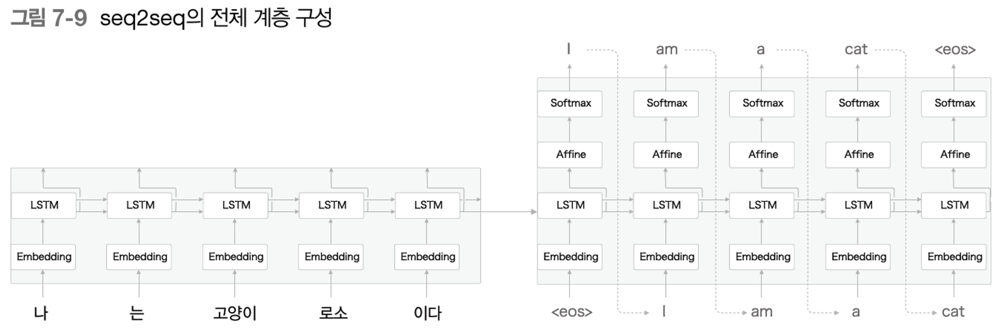

## 7.1 언어 모델을 사용한 문장 생성

**1) RNN을 사용한 문장 생성의 순서**

- RNNLM: 지금까지 주어진 단어들을 바탕으로 다음에 출현하는 단어의 확률분포 출력
- 생성 과정
    
    다음에 출현할 수 있는 단어들 중 확률이 가장 높은 단어 선택 ⇒ 이렇게 될 경우, 선택되는 단어가 매번 달라짐. 확률이 적으면 선택될 가능성이 낮아지는 것뿐!
    
- 이렇게 생성된 문장은 train data에 존재하지 않은, 이전에 없던 새로운 문장! (RNNLM은 train data를 암기한 것이 아니라, 사용된 단어의 정렬 패턴을 학습한 것이기 때문)

**2) 문장 생성 구현**

- RNNLMGEN
    
    ```python
    import sys
    sys.path.append('..')
    import numpy as np
    from common.functions import softmax
    from ch06.rnnlm import Rnnlm
    from ch06.better_rnnlm import BetterRnnlm
    
    class RnnlmGen(Rnnlm):
        def generate(self, start_id, skip_ids=None, sample_size=100):
            word_ids = [start_id]   #start token id
    
            x = start_id
            while len(word_ids) < sample_size:
                x = np.array(x).reshape(1, 1)
                score = self.predict(x)           #predict()는 미니배치를 처리하므로 x가 2차원 배열이어야 함!
                p = softmax(score.flatten())      #softmax를 통한 정규화(0~1 사이의 확률값으로 변형)
    
                sampled = np.random.choice(len(p), size=1, p=p)
                if (skip_ids is None) or (sampled not in skip_ids):   # skip_ids: <unk> 등 샘플링되지 않아야 할 단어 지정
                    x = sampled
                    word_ids.append(int(x))
    
            return word_ids
    
        def get_state(self):
            return self.lstm_layer.h, self.lstm_layer.c
    
        def set_state(self, state):
            self.lstm_layer.set_state(*state)
    ```
    
- RNNGEN을 통한 문장 생성
    
    아무것도 학습되지 않은 랜덤 가중치일 때와, 학습된 가중치를 이용해 문장을 생성할 경우 차이가 큼!
    
    생성할 때마다 결과가 다름(확률분포에 따라 샘플링된 단어의 연속이기 때문에 당연!)
    
    ```python
    import sys
    sys.path.append('..')
    from rnnlm_gen import RnnlmGen
    from dataset import ptb
    
    corpus, word_to_id, id_to_word = ptb.load_data('train')
    vocab_size = len(word_to_id)
    corpus_size = len(corpus)
    
    model = RnnlmGen()
    model.load_params('../ch06/Rnnlm.pkl')   #학습된 가중치 로드
    
    # start 문자와 skip 문자 설정
    start_word = 'you'
    start_id = word_to_id[start_word]  #'you'에 해당하는 id
    skip_words = ['N', '<unk>', '$']
    skip_ids = [word_to_id[w] for w in skip_words]
    
    # 문장 생성
    word_ids = model.generate(start_id, skip_ids)
    txt = ' '.join([id_to_word[i] for i in word_ids]) # 생성된 단어 ID배열을 띄어쓰기로 문장화
    txt = txt.replace(' <eos>', '.\n')
    print(txt)
    ```
    

**3) 더 좋은 문장으로**

- BETTER_RNNLM: 3가지 방안을 통해 성능을 개선시킨 모델로 생성해보자!
    
    보다 자연스러운 문장이 만들어지지만, 의미 상으로 개선할 부분이 많음
    
    'the meaning of life is'라는 글을 주고 다음 문장을 생성하려면? → 모델에 해당 글이 가지는 단어를 순서대로 주어 forward 수행 
    → 이 때 출력되는 단어는 사용하지 않지만, LSTM 계층에 해당 단어열 정보가 유지됨 → 그런 다음, 'is'를 첫 단어로 주면 이어지는 문장을 생성!
    
    ```python
    start_words = 'the meaning of life is'
    start_ids = [word_to_id[w] for w in start_words.split(' ')]  #문장을 단어로 나누기
    
    for x in start_ids[:-1]:
        x = np.array(x).reshape(1, 1)
        model.predict(x)  #마찬가지로 2차원 배열!   # 각 단어를 차례대로 넣음 
    
    word_ids = model.generate(start_ids[-1], skip_ids)   #'is'를 첫 단어로 주기
    word_ids = start_ids[:-1] + word_ids # is 이전 문장 + 생성된 문장
    txt = ' '.join([id_to_word[i] for i in word_ids])
    txt = txt.replace(' <eos>', '.\n')
    print('-' * 50)
    print(txt)
    ```
    

---

## 7.2 seq2seq

**1) seq2seq의 원리**

- seq2seq는 Encoder-Decoder 모델!
- Encoder: 입력 데이터를 인코딩     ex. 'A' - '10001'
- Decoder: 인코딩된 데이터를 디코딩    ex. '10001' - 'A'
- seq2seq의 구조
    
    Encoder가 인코딩한 정보에는 번역에 필요한 정보가 조밀하게 응축됨 → Decoder는 이 정보를 바탕으로 문장을 생성
    
    ex. '나는 고양이로소이다' - 'I am a cat'
    
    
    
    Encoder는 LSTM을 통해 '나는 고양이로소이다'를 $h$라는 hidden state로 변환(이 때, 이 $h$는 고정 길이벡터)
    
    즉, '인코딩한다' = '임의 길이의 문장을 고정 길이 벡터로 변환한다'
    
    Decoder는 RNNLM의 생성 모델을 그대로 이용(입력 데이터로 벡터 $h$를 받는다는 것만 다름)
    
    LSTM 계층이 Encoder와 Decoder를 이어 hidden state를 전달하는 역할!
    

**2) 시계열 데이터 변환용 장난감 문제**

- '57+5'를 입력했을 때 62를 반환하는 seq2seq
- 단어 단위가 아니라, 문자 단위로 문장을 분할해 리스트로 처리

  

**3) 가변 길이 시계열 데이터**

- '57+5'나 '628+521' 등 입력 데이터마다 길이가 다 다름 → 이전에 구현했던 RNN의 경우, 미니 배치 단위로 처리할 때 그 형상이 모두 똑같아야 했음!
- '패딩(padding)': 길이가 다른 데이터에 대해서 빈 공간에 의미 없는 데이터를 채워 길이를 맞추는 방법
- ex. 57+5_ _ _ , 628+521 , 220+8_ _ 처럼 빈 공간은 '_'로 표시해 길이 7로 맞춤
- 출력 데이터의 경우 질문과 정답을 구분하기 위해 결과값 앞에 '_'를 표시!     ex. 57+5_ _ _ = _ 6 2 _ _  (최대 출력값의 길이는 999+999 = 1998로, 4!)
- 출력값 앞에 붙는 '_'는 Decoder에 문자열을 생성하라고 알리는 신호로 사용됨
- 원래는 존재하지 않았던 패딩용 문자까지 seq2seq이 처리하려면, loss에 반영되지 않도록 Decoder와 Encoder를 수정해야 함

**4) 덧셈 데이터셋**

- get_vocab() 메소드를 통해 로드한 데이터를 문자와 문자ID로 대응 딕셔너리 반환

---

## 7.3 seq2seq 구현

**1) Encoder 클래스** 

- Embedding 계층: 문자 ID를 문자 벡터로 변환
- LSTM 계층: 각 셀마다 분기되는 2개의 출력 중 위 방향은 폐기되고, 시간 방향 hidden state만 흘러감
- 마지막 문자를 처리한 후에 출력되는 hidden state만 Decoder로 전달됨
- 마찬가지로 Time Embedding, Time LSTM 계층을 적용!


```python
class Encoder:
    def __init__(self, vocab_size, wordvec_size, hidden_size): #wordvec_size: 문자 벡터의 차원 수 #hidden_size: LSTM 계층의 hidden state 벡터의 차원 수
        V, D, H = vocab_size, wordvec_size, hidden_size   #vocab_size: 사용되는 문자의 수 ex. 0~9, +, '', _ = 13개  
        rn = np.random.randn

        embed_W = (rn(V, D) / 100).astype('f')
        lstm_Wx = (rn(D, 4 * H) / np.sqrt(D)).astype('f')  # Time LSTM이므로 4배!
        lstm_Wh = (rn(H, 4 * H) / np.sqrt(H)).astype('f')
        lstm_b = np.zeros(4 * H).astype('f')

        self.embed = TimeEmbedding(embed_W)
        self.lstm = TimeLSTM(lstm_Wx, lstm_Wh, lstm_b, stateful=False)   #긴 시계열 데이터가 아니라, 여러 개의 짧은 시계열 데이터를 처리하므로 hidden state 영벡터로 초기화

        self.params = self.embed.params + self.lstm.params
        self.grads = self.embed.grads + self.lstm.grads
        self.hs = None

    def forward(self, xs):
        xs = self.embed.forward(xs)
        hs = self.lstm.forward(xs)   #Embedding 계층과 LSTM 계층 각각의 forward() 호출
        self.hs = hs
        return hs[:, -1, :]    #마지막 시점의 hidden state만 출력해 Decoder로 전달

    def backward(self, dh):  #마지막 hidden state에 대한 기울기를 인수로 받음 
        dhs = np.zeros_like(self.hs)
        dhs[:, -1, :] = dh  #해당 위치에 할당

        dout = self.lstm.backward(dhs)
        dout = self.embed.backward(dout)    #Embedding 계층과 LSTM 계층 각각의 backward() 호출
        return dout
```

**2) Decoder 클래스**

- Decoder의 계층 구성
    
    
    
- 정답 데이터 '_62'를 입력했을 때, '62  '를 출력하도록 학습
- RNNLM 문장 생성의 경우 softmax함수를 이용해 매번 다른 문장이 생성될 수 있도록 했지만, 이번에는 확률이 아니라 결정적으로 점수가 가장 높은 문자를 선택하도록 함
- Embedding → LSTM → Affine → argmax   (softmax 사용x)
- 이렇게 Decoder를 구성하고, 그 이후 seq2seq클래스를 통해 Time Softmax with Loss로 학습

```python
		def backward(self, dscore):  #기울기 dscore를 받아 Affine -> LSTM -> Embedding 순으로 전파
		        dout = self.affine.backward(dscore)
		        dout = self.lstm.backward(dout)
		        dout = self.embed.backward(dout)
		        dh = self.lstm.dh  #LSTM 계층의 시간방향 기울기는 TimeLSTM 클래스의 인스턴스 변수 dh에 저장됨
		        return dh

    def generate(self, h, start_id, sample_size):  # Encoder로부터 받는 hidden state, 최초로 주어지는 문자 ID, 생성하는 문자 수
        sampled = []
        sample_id = start_id
        self.lstm.set_state(h)

        for _ in range(sample_size):
            x = np.array(sample_id).reshape((1, 1))  #문자 1개를 입력하고
            out = self.embed.forward(x)
            out = self.lstm.forward(out)
            score = self.affine.forward(out)

            sample_id = np.argmax(score.flatten())   #Affine 계층이 출력하는 점수가 가장 큰 문자 ID를 선택 
            sampled.append(int(sample_id))

        return sampled
```

**3) seq2seq 클래스**

- seq2seq 클래스 구현: Encoder 클래스와 Decoder 클래스를 연결 → Time Softmax with Loss 계층을 이용해 loss 계산
    
    ```python
    class Seq2seq(BaseModel):
        def __init__(self, vocab_size, wordvec_size, hidden_size):
            V, D, H = vocab_size, wordvec_size, hidden_size
            self.encoder = Encoder(V, D, H)
            self.decoder = Decoder(V, D, H)
            self.softmax = TimeSoftmaxWithLoss()
    
            self.params = self.encoder.params + self.decoder.params
            self.grads = self.encoder.grads + self.decoder.grads
    
        def forward(self, xs, ts):
            decoder_xs, decoder_ts = ts[:, :-1], ts[:, 1:]
    
            h = self.encoder.forward(xs)
            score = self.decoder.forward(decoder_xs, h)
            loss = self.softmax.forward(score, decoder_ts)
            return loss
    
        def backward(self, dout=1):
            dout = self.softmax.backward(dout)
            dh = self.decoder.backward(dout)
            dout = self.encoder.backward(dh)
            return dout
    
        def generate(self, xs, start_id, sample_size):
            h = self.encoder.forward(xs)
            sampled = self.decoder.generate(h, start_id, sample_size)
            return sampled
    ```
    

**4) seq2seq 평가**

1. 학습 데이터에서 미니배치 선택 → 2. 미니배치로부터 기울기 계산 → 3. 기울기를 이용해 매개변수 갱신
- 매 epoch마다 생성된 문자열과 정답을 비교해 학습 중간 정답률 측정
    
    ```python
    acc_list = []
    for epoch in range(max_epoch):
        trainer.fit(x_train, t_train, max_epoch=1,
                    batch_size=batch_size, max_grad=max_grad)
    
        correct_num = 0
        for i in range(len(x_test)):
            question, correct = x_test[[i]], t_test[[i]]
            verbose = i < 10
            correct_num += eval_seq2seq(model, question, correct,    # question: 문제 문장 correct: 정답 문자 ID 배열
                                        id_to_char, verbose, is_reverse)
    
        acc = float(correct_num) / len(x_test)   #정답률
        acc_list.append(acc)
        print('검증 정확도 %.3f%%' % (acc * 100))
    ```
    
- epoch이 진행될수록 개선되는 정답률!
    
    
    ---
    

## 7.4 seq2seq 개선

**1) 입력 데이터 반전(Reverse)**

- 128+246 → 642+821 로 입력 데이터를 reverse시키는 트릭!
- 간단한 반전을 통해 높은 정답률 상승
- Why?
    
    '나는 고양이로소이다 → I am a cat' 의 경우에서 '나'를 'I'로 번역하려면 '는 고양이로소이다' 가 포함된 총 4개 LSTM계층을 통과해야 함
    
    But, 입력 데이터를 반전시킬 경우 '다이소로이양이고 나 → I am a cat'으로, '나'와 'I' 학습에 필요한 기울기가 직접 전해짐
    

**2) 엿보기(Peeky)**

- Peeky를 통한 개선
    
    
    
    Decoder는 Encoder가 출력한 hidden state(고정 길이 벡터)를 받아 작동
    
    그러나, Decoder의 최초 LSTM 계층만 이 hidden state를 전달받음 → 다른 계층도 전달받아 이 정보를 공유할 수는 없을까?
    
    ⇒ 기존에는 하나의 LSTM만이 소유하던 중요 정보 h를 모든 시각의 Affine 계층과 LSTM 계층에 전달함!
    
- 각 시점의 계층이 받게 되는 2개 벡터는 concat해서 입력됨!
- Decoder 구현
    
    ```python
    class PeekyDecoder:
        def __init__(self, vocab_size, wordvec_size, hidden_size):
            V, D, H = vocab_size, wordvec_size, hidden_size
            rn = np.random.randn
    
            embed_W = (rn(V, D) / 100).astype('f')
            lstm_Wx = (rn(H + D, 4 * H) / np.sqrt(H + D)).astype('f')    # LSTM 계층의 형상 -> hidden state vector의 길이도 추가됨
            lstm_Wh = (rn(H, 4 * H) / np.sqrt(H)).astype('f')
            lstm_b = np.zeros(4 * H).astype('f')
            affine_W = (rn(H + H, V) / np.sqrt(H + H)).astype('f')       # Affine 계층의 형상 -> hidden state vector의 길이도 추가됨
            affine_b = np.zeros(V).astype('f')
    
            self.embed = TimeEmbedding(embed_W)
            self.lstm = TimeLSTM(lstm_Wx, lstm_Wh, lstm_b, stateful=True)
            self.affine = TimeAffine(affine_W, affine_b)
    
            self.params, self.grads = [], []
            for layer in (self.embed, self.lstm, self.affine):
                self.params += layer.params
                self.grads += layer.grads
            self.cache = None
    
        def forward(self, xs, h):
            N, T = xs.shape
            N, H = h.shape
    
            self.lstm.set_state(h)
    
            out = self.embed.forward(xs)
            hs = np.repeat(h, T, axis=0).reshape(N, T, H)     # hidden state를 시점의 수 T만큼 복제해 hs에 저장
            out = np.concatenate((hs, out), axis=2)    # hs와 Embedding계층의 출력을 concat시켜 연결
    
            out = self.lstm.forward(out)
            out = np.concatenate((hs, out), axis=2)    # hs와 Embedding계층의 출력을 concat시켜 연결
    
            score = self.affine.forward(out)
            self.cache = H
            return score
    ```
    
- Peeky를 사용하게 되면 그만큼 계산되는 매개변수도 늘어남
- seq2seq의 정확도는 하이퍼파라미터에 영향을 크게 받으며, 어텐션을 통해 극적인 개선을 이룰 수 있음
    
    
    ---
    

## 7.5 seq2seq를 이용하는 애플리케이션

0) seq2seq을이용하는 애플리케이션

- seq2seq은 결국 '한 시계열 데이터'를 '다른 시계열 데이터'로 변환
- 즉, 2개가 짝을 이루는 시계열 데이터를 다루는 문제에 이용할 수 있음
- 입출력 데이터 전처리를 통해 seq2seq을 적용할 수도!

1) 챗봇

- 대화는 '상대의 말'과 '자신의 말'로 구성된 것 → 상대의 말을 자신의 말로 변환하는 태스크라고 볼 수 있음

2) 알고리즘 학습

- '덧셈'과 같은 간단한 문제 말고도, 더 고차원적인 문제도 처리할 수 있음
- ex. for이나 if문 등 파이썬 코드
- 소스코드를 그대로 seq2seq에 입력할 수 있고, 원하는 답과 대조하여 학습시킬 수 있음

3) 이미지 캡셔닝

- 이미지 캡셔닝: 이미지를 문장으로 변환
- ex. input data로 이미지를 넣었을 때 어떤 사진인지에 대한 설명을 문장으로 출력
- Encoder를 CNN, Decoder를 LSTM(8장에서 다룬 신경망과 동일)으로!
cf) CNN의 경우 최종 출력이 3차원의 feature map이므로, 1차원으로 flatten한 수 Affine 계층을 통해 변환시켜 Decoder인 LSTM이 처리할 수 있도록 처리