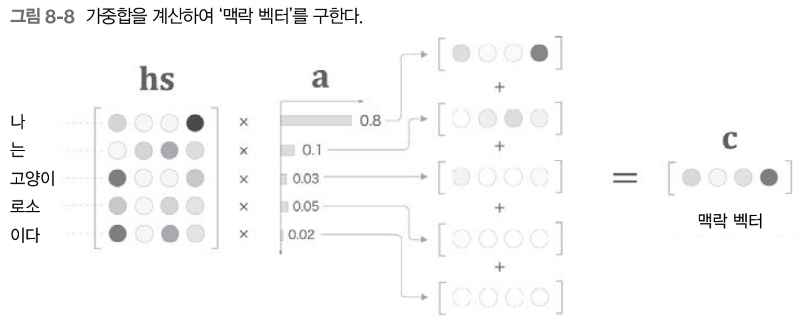
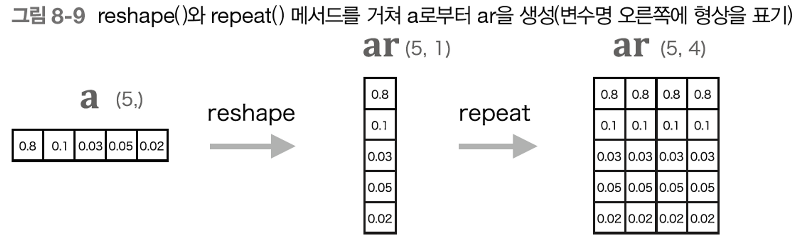
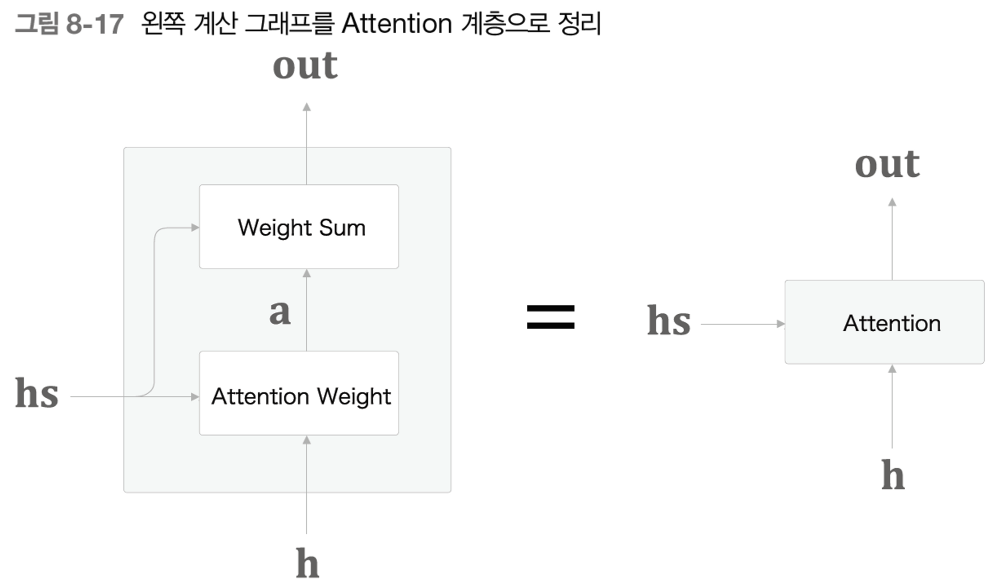
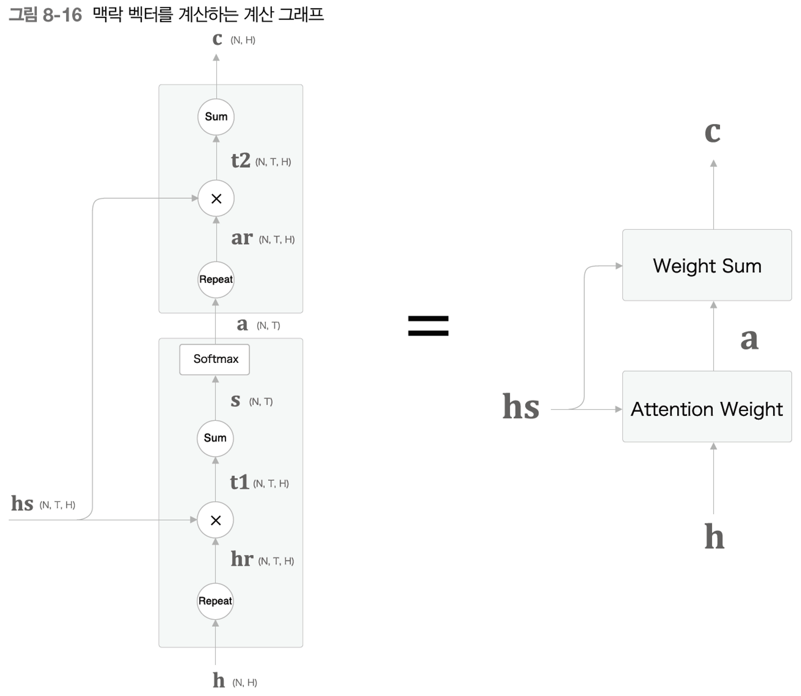
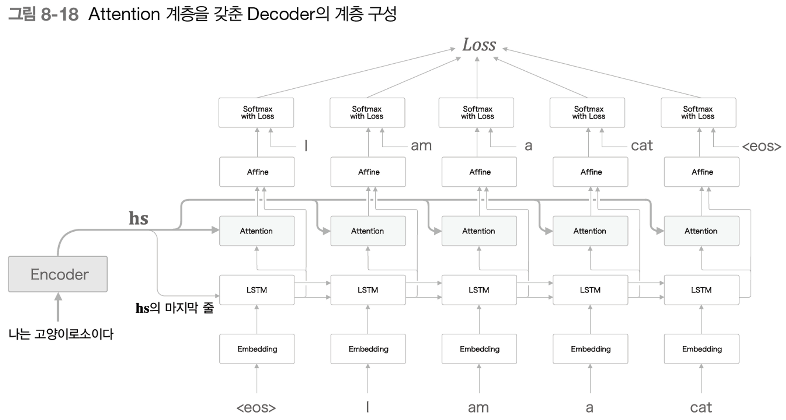
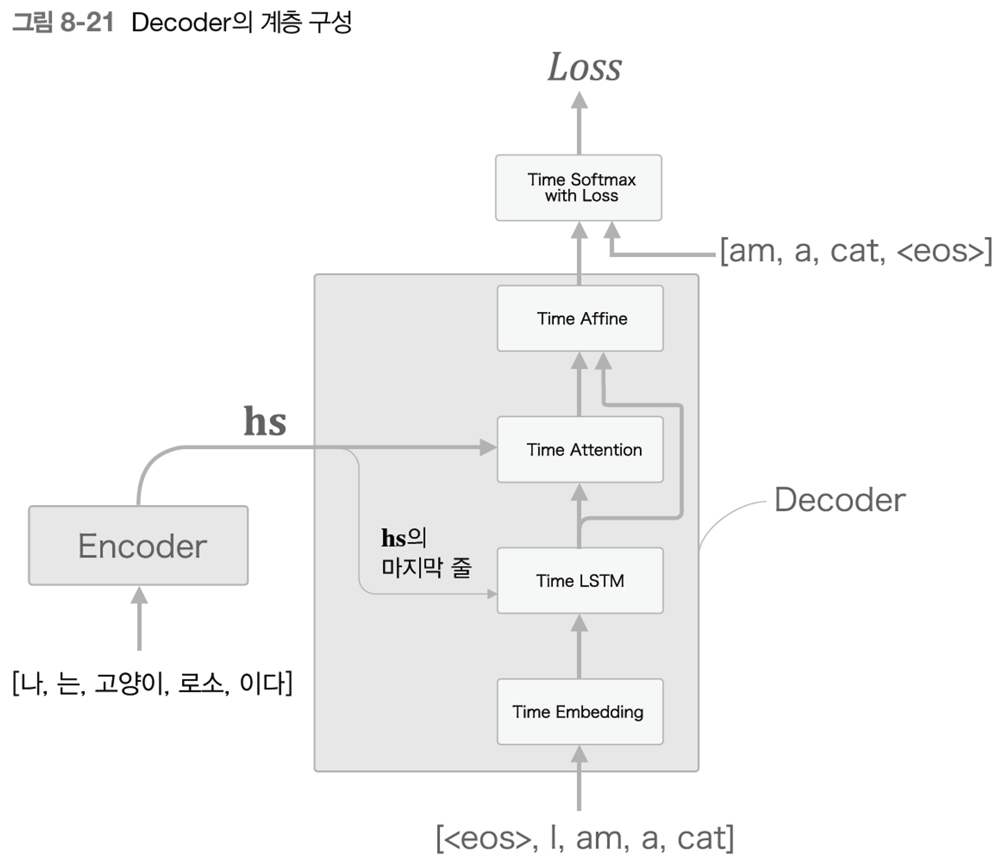

## 8.1 어텐션의 구조

**1) seq2seq의 문제점**

- seq2seq의 구조
    
    Encoder가 고정 길이 벡터 h를 출력해, 이를 Decoder에 전달
    
    ⇒ 입력 문장의 길이에 상관없이 항상 '같은' 길이의 벡터를 출력한다는 것이 문제점! (아무리 길어도 억지로 의미를 담아 짧은 길이 벡터로 변환하는 경우)
    

**2) Encoder 개선**

- Encoder가 출력하는 h의 길이를 입력 문장의 길이에 따라 바꿔주고자 함
    
    마지막 셀이 출력하는 h만 전달 x → 각 시점의 hidden state vector를 모두 이용하자!  ex.  5개 단어를 가진 문장 입력 → 5개 벡터 출력
    
- 각 시점의 hidden state vector는 직전에 입력된 단어에 대한 정보가 많이 포함됨
- 즉, Encoder가 출력하는 hs 행렬은 각 단어에 해당하는 벡터들의 집합!
- Encoder는 왼쪽에서 오른쪽으로 처리하므로, 일방향 정보만 담김 → 양방향 RNN 등장

**3) Decoder 개선 - 1**

- 단순 seq2seq
    
    Encoder가 고정 길이 벡터 h를 출력해, 이를 Decoder에 전달
    
    여기서 h는 Encoder의 LSTM 계층의 '마지막' hidden state vector! (=hs의 마지막 줄만 빼내어 Decoder에 전달)
    
    ⇒ 이 hs 전부를 활용할 수 있도록 Decoder를 개선해보자!
    
- hs 전부를 활용하는 방안
    
    '나는 고양이로소이다' → 'I am a cat' 으로 번역하고자 할 때, 사람의 경우 '나' = 'I', '고양이' = 'cat' 등의 1대1 지식을 이용함
    
    마찬가지로, '어떤 단어'에 주목하여 그 단어의 변환을 수시로 하게 해보자!
    
    ⇒ '도착어 단어'와 대응 관계에 있는 '출발어 단어'의 정보를 골라내는 것(어텐션)이 목표
    
- 전체 신경망 구조
    
    LSTM 계층과 Affine 계층 사이에 '어떤 계산'을 수행하는 새로운 계층을 추가함
    
    이 '어떤 계산' 계층이 받는 input은 2개 → 1. Encoder로부터 받는 hs     2. 각 시점의 LSTM 계층이 출력하는 hidden state
    
    단순 seq2seq의 구조와 동일하게, Encoder의 마지막 hidden state는 Decoder의 첫번째 LSTM 계층에 전달함
    
    '어떤 계산'을 통해 단어들의 얼라이먼트 추출을 하고자 함 = 각 시점에서 Decoder에 입력된 단어와 대응하는 단어의 벡터를 hs에서 골라내기 = '선택'
    
    선택하는 작업은 미분이 불가능하다는 문제점 → 가중치합 이용
    
- 가중치를 통한 '선택'
    
    '선택'하는 작업을 미분 가능한 연산으로 대체하자!
    
    
    
    각 단어에 해당하는 가중치를 별도로 계산(a)
    
    가중치 a와 각 단어의 벡터 hs로부터 weighted sum을 구함 → 우리가 원하는 맥락 벡터 c를 도출!
    
    맥락 벡터 c에는 '나' 벡터의 성분이 많이 포함되어 있음!
    
    ⇒ 즉, '나' 벡터를 선택하는 작업을 weighted sum 으로 대체 
    
- Weighted Sum 계층 구현
    
    
    
    hs와 ar의 원소별 곱을 통해 weighted sum 산출! reshape() → repeat() → * → np.sum()
    
    ⇒ 미니 배치 처리의 경우, (N, T, H) == (10, 5, 4)
    
    cf) repeat() 메소드 대신 브로드캐스트를 적용해도 됨
    
    repeat노드와 sum노드의 역전파는 각각 sum, repeat
    
    ```python
    class WeightSum:
        def __init__(self):
            self.params, self.grads = [], []
            self.cache = None
    
        def forward(self, hs, a):
            N, T, H = hs.shape
    
            ar = a.reshape(N, T, 1)     #.repeat(T, axis=1)
            t = hs * ar
            c = np.sum(t, axis=1)   # hs와 가중치 ar의 원소별 곱을 통한 맥락 벡터 도출
    
            self.cache = (hs, ar)
            return c
    
        def backward(self, dc):
            hs, ar = self.cache
            N, T, H = hs.shape
            dt = dc.reshape(N, 1, H).repeat(T, axis=1)   #sum 노드의 역전파 = repeat
            dar = dt * hs
            dhs = dt * ar
            da = np.sum(dar, axis=2)  #repeat 노드의 역전파 = sum
    
            return dhs, da
    ```
    

**4) Decoder 개선 - 2**

- a를 구하는 방법(a: hs를 이루는 각 단어의 가중치)
    
    목표: h가 hs의 각 단어 벡터와 얼마나 유사한가를 수치로 나타내는 것! (h: Decoder의 LSTM 계층이 출력하는 hidden state)
    
    → 벡터의 '내적'을 유사도의 척도로 판단해보자
    
    h와 hs의 내적을 이용해 유사도 스코어 도출 → softmax를 통해 0과 1 사이 실수로 정규화
    
    ```python
    class AttentionWeight:
        def __init__(self):
            self.params, self.grads = [], []
            self.softmax = Softmax()
            self.cache = None
    
        def forward(self, hs, h):
            N, T, H = hs.shape
    
            hr = h.reshape(N, 1, H)#.repeat(T, axis=1)   # h: Decoder의 LSTM 계층이 출력한 hidden state
            t = hs * hr    # 내적하는 과정
            s = np.sum(t, axis=2)   # 내적하는 과정
            a = self.softmax.forward(s)    #정규화
    
            self.cache = (hs, hr)
            return a
    
        def backward(self, da):
            hs, hr = self.cache
            N, T, H = hs.shape
    
            ds = self.softmax.backward(da)
            dt = ds.reshape(N, T, 1).repeat(H, axis=2)
            dhs = dt * hr
            dhr = dt * hs
            dh = np.sum(dhr, axis=1)
    
            return dhs, dh
    ```
    

**5) Decoder 개선 - 3**

- Attention Weight 계층과 Weighted Sum 계층 병합
    
    
    
    
    

<aside>
🌏 Attention Weight 계층 :  Encoder가 출력하는 각 단어의 벡터 hs에 집중해 해당 단어의 가중치 a 도출
Weighted Sum 계층 :  a와 hs의 가중합을 구하고, 그 결과 맥락 벡터 c 출력
⇒ 위 2개 계층을 합쳐 Attention 계층으로 부르기로!

</aside>

- LSTM 계층과 Affine 계층 사이에 Attention 계층 삽입
    
    
    
    Attention 계층에는 Encoder의 출력인 hidden state가 입력됨
    
    Affine 계층에는 2개의 벡터가 입력됨 → 1. LSTM의 출력 hidden state  2. Attention 계층의 출력 맥락 벡터  →  2개 벡터를 concat!
    

---

## 8.2 어텐션을 갖춘 seq2seq 구현

**1) Encoder 구현**

```python
class AttentionEncoder(Encoder):
    def forward(self, xs):
        xs = self.embed.forward(xs)
        hs = self.lstm.forward(xs)   # 모든 hidden state 반환
        return hs

    def backward(self, dhs):
        dout = self.lstm.backward(dhs)
        dout = self.embed.backward(dout)
        return dout
```

**2) Decoder 구현**



```python
class AttentionDecoder:
    def __init__(self, vocab_size, wordvec_size, hidden_size):
        V, D, H = vocab_size, wordvec_size, hidden_size
        rn = np.random.randn

        embed_W = (rn(V, D) / 100).astype('f')
        lstm_Wx = (rn(D, 4 * H) / np.sqrt(D)).astype('f')
        lstm_Wh = (rn(H, 4 * H) / np.sqrt(H)).astype('f')
        lstm_b = np.zeros(4 * H).astype('f')
        affine_W = (rn(2*H, V) / np.sqrt(2*H)).astype('f')
        affine_b = np.zeros(V).astype('f')

        self.embed = TimeEmbedding(embed_W)
        self.lstm = TimeLSTM(lstm_Wx, lstm_Wh, lstm_b, stateful=True)
        self.attention = TimeAttention()  # Attention 계층 추가
        self.affine = TimeAffine(affine_W, affine_b)
        layers = [self.embed, self.lstm, self.attention, self.affine]

        self.params, self.grads = [], []
        for layer in layers:
            self.params += layer.params
            self.grads += layer.grads

    def forward(self, xs, enc_hs):   # enc_hs: Encoder의 출력 hideen state
        h = enc_hs[:,-1]
        self.lstm.set_state(h)

        out = self.embed.forward(xs)
        dec_hs = self.lstm.forward(out)
        c = self.attention.forward(enc_hs, dec_hs)  #attention 계층을 통한 맥락 벡터 도출
        out = np.concatenate((c, dec_hs), axis=2)  # 맥락벡터와 LSTM 계층의 출력을 concat
        score = self.affine.forward(out)

        return score  # backward, generate 메소드 생략
```

**3) seq2seq 구현**

- AttentionEncoder와 AttentionDecoder로 변환

---

## 8.3 어텐션 평가

**1) 날짜 형식 변환 문제**

- 날짜 형식 변환 데이터셋
    
    입력되는 날짜 데이터에 다양한 변형이 존재해, 변환 규칙이 복잡함
    
    문제의 입력과 출력 사이에 대응관계 존재 → attention이 잘 이루어지고 있는지 평가 가능
    
- 학습 데이터 형식
    
    패딩을 통해 입력 데이터 길이 통일
    
    '_' 문자를 통해 입력과 출력 데이터 구분
    

**2) 어텐션을 갖춘 seq2seq의 학습**

- AttentionSeq2seq, Reverse 적용
    
    에폭마다 테스트 데이터를 사용하여 정답률 특정
    
- 결과
    
    단순한 seq2seq은 쓸모 없을 정도로 높은 정답률 차이를 보임
    
    Peeky를 적용한 결과와 비교했을 때, 결과적으로 동일한 정답률을 가지지만 학습 속도와 높은 정답률 달성 에폭에 있어 우세함
    

**3) 어텐션 시각화**

- 입력 문장과 출력 문장의 단어 대응 관계를 2차원 맵으로 시각화
    
    Time Attention 계층의 인스턴스 변수 attention_weights에 각 시각의 어텐션 가중치가 저장됨
    
- 결과
    
    'August' = '8월' 을 대응 관계만으로 학습함
    

---

## 8.4 어텐션에 관한 남은 이야기

**1) 양방향 RNN**

- 이전까지의 Encoder
    
    LSTM의 각 시각의 hidden state vector가 $hs$로 모아짐 → $hs$의 각 행에는 그 행에 대응되는 단어의 성분이 포함되어 있음
    
    But, 우리는 글을 왼쪽에서 오른쪽에서 읽는다! → '나는 고양이로소이다'에서 '고양이'에 대응하는 vector는 '나', '는', '고양이'까지 세 단어의 정보만 인코딩되어있음
    
    이러한 점을 극복해 '고양이' 단어의 주변 정보까지 균형 있게 담고자 함!
    
    ⇒ 양방향 LSTM(양방향 RNN) 등장
    
- 양방향 LSTM
    
    지금까지의 LSTM 계층 + 역방향 LSTM 계층 = 각시각에서 두 LSTM 계층이 출력하는 hidden state를 연결해 최종 hidden state로 처리 (연결, 평균, 합 등 다양한 방법이 있음)
    
    역방향 LSTM 계층에는 입력 문장의 단어들을 반대 순서로 나열해 처리하는 것으로 구현!
    

**2) Attention 계층 사용 방법**

- Attention 계층 삽입 장소 변경
    
    이전에는 LSTM 계층과 Affine 계층 사이에 Attention 계층 삽입 → Attention 계층의 출력인 맥락 벡터가 다음 시각의 LSTM 계층에 입력되도록 연결
    
    정확도는 데이터에 따라 다르며, 구현 관점에서 어려워질 가능성도 높음
    

**3) seq2seq 심층화와 skip 연결**

- seq2seq 심층화
    
    LSTM 계층을 더 깊게 쌓는 방법   cf) 계층을 깊게 할수록 일반화 성능을 떨어뜨리지 않는 것이 중요! 
    
    Attention 계층의 사용법 변환 → Decoder의 LSTM계층의 출력 hidden state를 Attention 계층에 입력 → Attention 계층의 출력 맥락벡터를 Decoder의 여러 계층으로 전파
    
- skip connection
    
    LSTM 계층을 건너뛰는 연결 → skip한 결과와 LSTM 계층을 건너온 결과는 '+(덧셈)' 으로 합쳐짐
    
    why?  →  덧셈은 역전파 시 기울기를 그대로 흘려보내기 때문에 skip connection의 기울기에 영향이 없음 → 따라서, 기울기 소실 or 폭발 문제가 발생x! 
    

---

## 8.4 어텐션 응용

**1) 구글 신경망 기계 번역(GNMT)**

- Neural Machine Translation
    
    NMT: seq2seq을 사용한 기계 번역의 총칭
    
    GNMT: 어텐션을 갖춘 seq2seq와 동일하게 Encoder, Decoder, Attention으로 구성 + LSTM의 다층화, 양방향 LSTM, skip connection
    

**2) 트랜스포머**

- RNN의 단점
    
    RNN은 언어 모델, 문장 생성, seq2seq, 어텐션을 갖춘 seq2seq까지 가변 길이 시계열 데이터를 처리한다는 점에서 다양한 곳에 쓰임
    
    But, 병렬 처리 면에 있어 단점 존재 
    
- 트랜스포머
    
    '셀프 어텐션' 기술이 핵심! : 하나의 시계열 데이터 내에서 각 원소가 다른 원소들과 어떻게 관련되는지 살펴봄 (RNN 계층 존재 X,  어텐션만 이용!)
    
    기존 Time Attention 계층에는 두 개의 다른 시계열 데이터가 입력됨 → Self-Attention 계층에는 하나의 시계열에서 나온 출력이 두 개의 입력으로 들어감
    
    트랜스포머 구조: Embedding → Attention → Feed Forward → Affine → Softmax   
    
    cf) Feed Forward: 시간 방향으로 독립적으로 처리하는 신경망 
    
    계산량 감소,  GPU를 이용한 병렬 계산 가능, 학습 시간 단축, 번역 성능 상승
    

**3) 뉴럴 튜링 머신(NTM)**

- NTM의 계층 구성
    
    메모리 쓰기와 읽기를 수행하는 Write Head 계층과 Read Head 계층이 새로 등장
    
    LSTM 계층의 hidden state를 Write Head가 받아서 필요한 정보를 메모리에 씀 → Read Head 계층이 메모리로부터 중요한 정보를 읽어 들여 다음 시점의 LSTM 계층에 전달
    
- 어텐션
    
    2개의 어텐션으로 컴퓨터의 메모리 조작: '콘텐츠 기반 어텐션'과 '위치 기반 어텐션'
    
    콘텐츠 기반 어텐션: 입력으로 주어진 query vector와 비슷한 vector를 메모리로부터 찾아냄
    
    위치 기반 어텐션: 이전 시점에서 주목한 메모리의 위치를 기준으로 그 전후를 이동(1차원 CNN으로 구현)
    
    외부 메모리를 사용함으로써 알고리즘을 학습하는 능력!