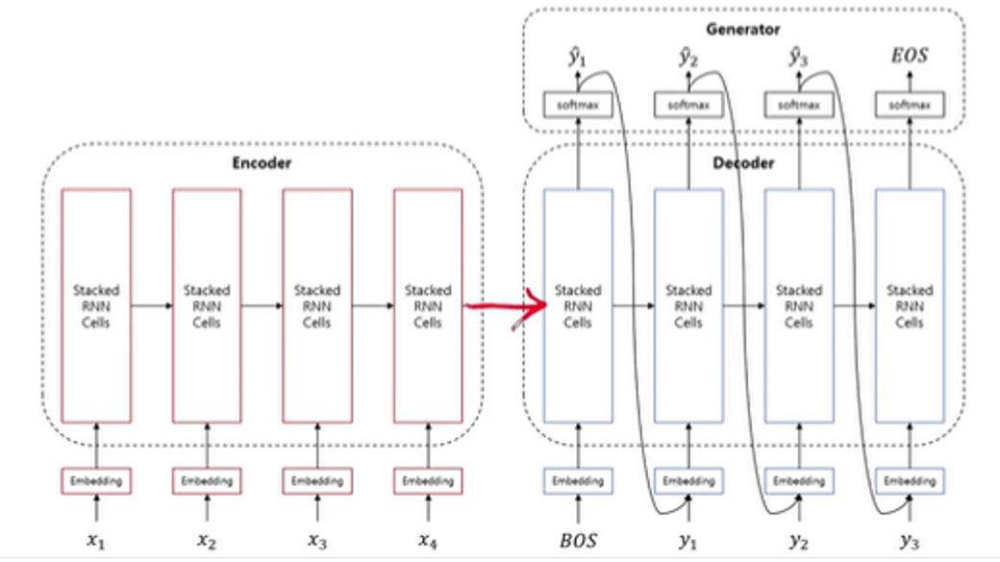
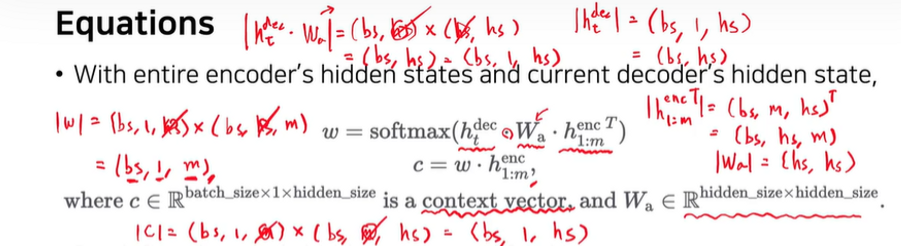

## 3.1 Seq2Seq부터 Transformer까지

### 1) Natural Language Generation

- auto-regressive: 이전의 상태가 앞으로의 상태를 좌우 = 이전 단어가 주어졌을 때 다음 단어를 예측
- machine translation: seq2seq과 attention의 등장으로 가장 먼저 상용화됨

---

### 2) Sequence to Sequence

- seq2seq
    
    
    
- Encoder: sequence를 하나의 context vector로 압축
- Decoder: context vector를 하나의 condition으로 받는 조건부 언어모델
- Generator: 디코더의 hidden state를 softmax를 통해 multinoulli분포로 변환
- seq2seq에 attention을 더해서 꽃을 피웠다!
- 기존 구글에서 LSTM을 이용한 seq2seq으로 성능을 냈지만 페이스북에서 fully convolution을 사용

---

### 3) Attention is all you need

## 3.2 Attention

### 1) Before Attention

- attention이 없는 seq2seq
    
    → 긴 문장에 대해서 올바른 값을 내지 않음
    
- lstm이 좀 더 long dependency를 해결할 수 있지만, 그래도 한계가 있음
- encoder에서 decoder로 넘어갈때 담을 수 있는 정보의 한계!

### 2) Attention

**(1) 직관적으로 알아보기**

- '학교에' → encoder의 key들과 query를 비교 → similarity 도출 → weighted sum = context vector → concat = new hidden state
- encoder를 통해 나온 new hidden state와 어떤 학교인지 헷갈렸던 vector가 합쳐짐
- decoder는 encoder에 검색해서 필요한 정보를 취해오는 것!
- 검색을 하는 과정과 비슷 → 검색하는 매개체는 linear transformation!

**(2) Equations**

- 매 타임마다 디코더의 hidden state가 인코더에 대해서 attention작업을 수행해야 함
- weight vector
    
    
    
    w:  weight 
    
    bs: batch size
    
    hs: hidden state size
    
    1: one time step
    
    m: m번째 time step
    
    결과 최종 w: decoder의 현재 time step에 대해 각 encoder의 time step에 맞는 사이즈 → context vector: (bs, 1, m) x (bs, m, hs) = (bs, 1, hs)

**(3) Conclusion**

- attention은 미분 가능한 key-value function이다.
- attention 함수의 입력은 Q K V (쿼리 키 밸류)
- 정보를 잘 얻기 위한 쿼리를 변환하는 방법을 배우는 과정
- attention을 통해 hidden state의 한계(긴 길이의 입/출력에 대한 한계)를 극복

---

## 3.3 Masking at Attention

### 1) Masking

**(1) Motivation**

- mini-batch parallelize를 하기에 각 문장은 길이가 다름 → 가장 길이가 긴 문장을 기준으로 나머지 토큰에 PAD 입력
- PAD가 있는 문장 모두 쿼리와 키에 들어가면 similarity가 나올 수 밖에 없음 → 잘못된 곳에 attention의 weight가 가게 될 것
- 강제적으로 해당 부분에 0을 만들어줘야 함! (dot product 결과 *-무한대*  만들어주기)

**(2) Solution**

- dot product 결과값(batch size x n) 내 PAD 자리에 MASK(*-무한대* 만들어주기) 후 softmax ⇒ attention weight: 0

**(3) Wrap-up**

---

## 3.4 Transformer

### 1)