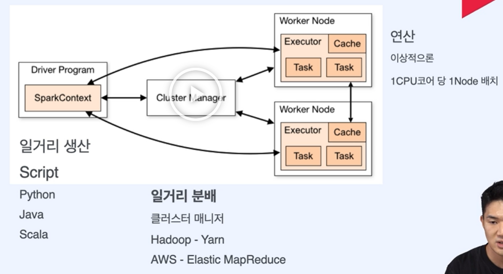
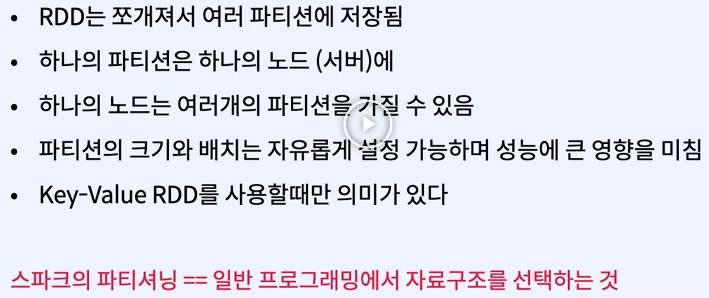

## 1.4 Data Orchestration

- 오케스트레이션이란?
    1. 태스크 스케줄링
    2. 분산 실행
    3. 태스크 간 의존성 관리

## 2.1.4 우버 트립수 세기

- spark-submit: 클러스터 매니저에게 작업을 제출하는 코드
- 명령을 입력하는 순간 전체 파일이 클러스터 매니저에게 전달됨

## 2.1.5 About Spark

- Spark Cluster
    
    
    
- 왜 내 컴퓨터에서는 스파크보다 파이썬이 빠를까?
    - 파이썬은 데이터 속도가 빨라지지만 일정 데이터 크기가 되면 OOM 에러
    - 스파크는 속도는 느리 지만 데이터가 커져도 연산 가능
- 노드는 필요에 따라 계속 늘릴 수 있다.(1CPU - 1 NODE)

## 2.1.7 RDD

```python
# 패키지를 가져오고
from pyspark import SparkConf, SparkContext
import pandas as pd

# Spark 설정
conf = SparkConf().setMaster("local").setAppName("uber-date-trips")
sc = SparkContext(conf=conf)

# 우리가 가져올 데이터가 있는 파일
directory = "C:/Users/rhawl/Desktop/study/FastCampus/data-engineering/01-spark/data"
filename = "fhvhv_tripdata_2020-03.csv"

# 데이터 파싱
lines = sc.textFile(f"file:///{directory}/{filename}")
header = lines.first() 
filtered_lines = lines.filter(lambda row:row != header) 

# 필요한 부분만 골라내서 세는 부분
# countByValue로 같은 날짜등장하는 부분을 센다
dates = filtered_lines.map(lambda x: x.split(",")[2].split(" ")[0])
result = dates.countByValue()

# 아래는 Spark코드가 아닌 일반적인 파이썬 코드
# CSV로 결과값 저장 
pd.Series(result, name="trips").to_csv("trips_date.csv")
```

- SparkContext를 통해 sc 생성 → sc 객체를 통해 lines 생성
- 여기서 lines가 바로 RDD!
- 예제처럼 sc.textFile()로 가져올 수도 있고, 데이터베이스에 담긴 데이터 형태로 RDD를 가져올 수 있음
- RDD의 특징
    1. 데이터 추상화: 데이터는 클러스터에 흩어져 있지만 하나의 파일인 것처럼 사용이 가능하다. → textFile이 100페타바이트라고 가정할 때, 여러 노드에 담긴 파일을 lines라는 하나의 객체로 활용
    2. 탄력적이고 불변하는 성질
        1. 데이터가 여러군데서 연산될 때 여러 노드 중 하나가 망가진다면?(네트워크 장애, 하드웨어/메모리 문제)
        → immutable하기 때문에 복원 가능하다
        2. immutable: RDD1이 변환을 거치면 RDD1이 바뀌는게 아니라 새로운 RDD2가 만들어진다.
        → RDD의 변환 과정은 하나의 비순환 그래프로 그릴 수 있기 때문에, 문제가 생길 경우 쉽게 전 RDD로 돌아갈 수 있다. 
        3. 탄력적: node1이 연산 중 문제가 생기면 다시 복원 후 node2에서 연산하면 된다.
    3. Type-safe: 컴파일 시 type을 판별할 수 있어 문제를 일찍 발견할 수 있다. (integer rdd, string rdd 등) → 개발자 친화적
    4. 정형/비정형 데이터 둘다 담을 수 있다. (로그, 자연어/RDB, DataFrame)
    5.  Lazy: 결과가 필요할 때까지 연산을 하지 않는다.
        1. Action을 할 때까지 Transformation하지 않는다. → action을 만나면 전부 실행된다.
        2. Spark Operation: transform+action
- 왜 RDD를 쓸까
    - 유연하다.
    - 짧은 코드로 할 수 있는게 많다.
    - 개발할 때 무엇보다는 어떻게에 대해 더 생각하게 한다.

## 2.2.1 병렬처리와 분산처리

- Data-Parallel? → RDD.map(<task>)
    1. 데이터를 여러개로 쪼개고
    2. 여러 쓰레드에서 각자 task를 적용(1 node 안에서 데이터를 나눠서 처리)
    3. 각자 만든 결과값을 합치는 과정
- Distributed Data-Parallel?
    1. 데이터를 여러개로 쪼개서 여러 노드로 보낸다.
    2. 여러 노드에서 각자 독립적으로 task를 적용
    3. 각자 만든 결과값을 합치는 과정
    
    → 노드간 통신같이 신경써야 될 것이 늘어난다. 
    
    - Spark를 이용하면 분산된 환경에서도 일반적인 병렬처리를 하듯 코드를 짜는게 가능
    - HOW?
        - RDD 덕분!: 분산된 환경에서 데이터 병렬 모델을 구현해 추상화시켜주기 때문
- **노드간 통신 속도를 신경써서 코딩해야 성능을 올릴 수 있다!**

## 2.2.2 분산처리와 Latency

- 분산처리로 넘어가면서 신경써야 되는 문제들
    - 부분 실패: 노드 몇개가 프로그램과 상관없는 이유로 실패
    - 속도: 많은 네트워크 통신을 필요로 하는 작업은 속도가 저하
    
    ```python
    RDD.map(A).filter(B).reduceByKey(C).take(100)
    RDD.map(A).reduceByKey(C).filter(B).take(100)
    ```
    
    - 두 코드의 속도가 완전히 다름
    - reducebykey:  여러노드에서 데이터를 불러와서 하나로 합치는 작업
    → 통신을 필요로 하는데, filter작업을 통해 데이터 양을 줄인 뒤 실행하는게 효율적
- 속도: 메모리 > 디스크> 네트워크
    - 네트워크는 메모리 연산에 비해 100만배 정도 느리다
    - Spark의 작업이 뒷단에서 어떻게 돌아갈지 상상을 하며 코딩하자

## 2.2.3 Key-Value RDD

- key와 value를 갖는 RDD: 간단한 데이터베이스처럼 다룰 수 있다.
- single value rdd는 텍스트에 등장하는 단어 수 세기와 같이 단일적, key-value rdd는 key값을 기준으로 평균을 내는 등 이차원적
ex) 지역 ID별로 택시 운행 수는 어떻게 될까?
- 코드상으로는 기존 rdd와 많이 다르지 않음
- Reduction: 키값을 기준으로 데이터를 묶어서 계산(데이터를 줄이는 일이기 때문에 reduce)
    - reducebykey(): 키값을 기준으로 태스크 처리
    - groupbykey(): 키값을 기준으로 밸류를 묶는다.
    - sortbykey(): 키값을 기준으로 정렬
    - keys(), values(): 키값, 밸류값 추출

```python
pairs = rdd.map(lambda x: (x,1))
count = pairs.reduceByKey(lambda a, b: a+b)
```

- Join: 여러개 rdd를 키값을 기준으로 join
- **key value 데이터에서 key를 바꾸지 않는 경우, map()대신 value만 다루는 mapValues()함수를 써주자!
→ spark 내부에서 파티션을 유지할 수 있어 더욱 효율적**

## 2.2.4 RDD Transformations and Actions

- transformation: 결과값으로 새로운 rdd를 반환
→ 지연 실행(lazy execution)
    - Narrow Transformation
        - 1대 1 변환
        - 1열을 조작하기 위해 다른 열/파티션의 데이터를 쓸 필요가 없다
        - 정렬이 필요하지 않은 경우
        - filter, map, flatMap, union 등
    - Wide Transformation
        - 셔플링!
        - 아웃풋 RDD의 파티션에 다른 파티션의 데이터가 들어갈 수 있음
        - intersection, join, distinct, reduceByKey 등
    - Transformation을 거칠 때는 action 전까지 실행되기 전에 어떤 걸 거쳐야할지 기억하는 DAG를 그리게 된다!!
- actions: 결과값을 연산하여 출력하거나 저장 - list 등 파이썬 네이티브 객체 반환
→ 즉시 실행
- 

## 2.2.5 Cache & Persist

- transform과 action, 왜 두 가지로 나뉘었을까?
    
    → 지연되는 연산이 유용한 경우가 있기 때문!
    
    - **메모리를 최대한 활용할 수가 있다. (디스크, 네트워크 연산을 최소화할 수 있다)**
    - **데이터를 다루는 task는 반복되는 경우가 많다 ex. 머신러닝 학습**
        - 반복을 할때 생기는 비효율: task-disk→다시 disk에서 task 읽-disk에 저장
        - **task에서 다른 task로 넘어갈 때 인메모리 방식**으로 바로 넘어가는 것이 더 좋음!
            
            → 어떤 데이터를 메모리에 남겨야 할지 알아야 가능하다.
            
            → transformation은 지연 실행되기 때문에 메모리에 저장할 수 있다.
            
- 데이터를 메모리에 저장해두고 사용이 가능한 함수: cache, persist
    
    ```python
    categoryReviews = filtered_lines.map(parse).**persist()**
    
    result1 = categoryReviews.take(10)
    result2 = categoryReviews.mapVlaues(lambda x: (x, 1)).collect()
    ```
    
    categoryReviews는 result1과 result2를 만들면서 2번 만들어짐
    
    .persist()를 추가하여 메모리에 저장해두고 쓸 수 있음
    
- 여러 종류의 storgae level
    - MEMORY_ONLY
    - MEMORY_AND_DISK
    - MEMORY_ONLY_SER: 메모리로 부족한 데이터는 serialization → 용량을 아낄 수는 있지만 다시 데이터를 읽어올 때 de-serialize해야하는 트레이드오프 발생
    - MEMOERY_AND_DISK_SER
    - DISK_ONLY
- Cache와 Persist의 차이점
    - cache
        - 디폴트 storage level 사용
        - RDD: MEMORY_ONY
        - DF: MEMORY_AND_DISK
    - persist
        - storage level을 사용자가 원하는대로 지정 가능

## 2.2.6 Cluster Topology(스파크 클러스터의 내부 구조)

- Spark: 마스터/워커 노드
    - 항상 데이터가 여러 곳에 분산되어있다!
    - 같은 연산이어도 여러 노드에 걸쳐서 실행된다!
- 마스터, 즉 Driver Program은 개발자나 유저가 직접 마주하고 rdd를 만드는 sparkcontext
- 실제 작업은 워커 노드에 보내서  task 실행
- 중간에 cluster manager: 스케줄링, 자원관리 (yarn 등)
- 실행 과정
    - driver program이 sc를 생성해서 spark application을 생성
    - sc가 cluster manager를 연결하고, cm이 자원 할당
    - cm이 워커노드의 executor를 수집하고 얘네가 연산, 데이터 저장
    - 실행된 task 결과값은 다시 sc로 감
- spark의 작업이 뒷단에서 어떻게 돌아갈지 상상코딩하자.

## 2.2.7 Reduction Operations

- Reduction: 요소들을 모아서 하나로 합치는 작업
- 병렬/분산된 환경에서의 reduction
- **ACTION은 어떻게 분산된 환경에서 작동할까?**
- 대부분의 action은 reduction → collect는 아님
- 병렬처리가 가능한 경우
    - 태스크들의 결과값을 점점 하나로 모으는 작업  ex.add
    - 파티션이 다른 파티션의 결과값에 의존할 경우 병렬처리가 불가능
- Reduce: 사용자가 지정하는 액션을 모아서 실행
    - 파티션에 따라 결과값이 달라진다.
    - 분산된 파티션들의 연산과 합치는 부분을 나눠서 생각하기!
    
    ```python
    sc.parallelize([1,2,3,4,5],1).reduce(lambda x,y: (x*2)+y)  # 26
    sc.parallelize([1,2,3,4,5],2).reduce(lambda x,y: (x*2)+y)  # 18
    sc.parallelize([1,2,3,4,5],3).reduce(lambda x,y: (x*2)+y)  # 18
    sc.parallelize([1,2,3,4,5],4).reduce(lambda x,y: (x*2)+y)  # 26
    ```
    
    - (1,2,3,4) / (1,2) (3,4)
- Fold: 첫번째 값으로 zeroValue가 들어간다.

## 2.2.9 Shuffling&Partitioning

- Shuffling
    - 그룹핑시 데이터를 한 노드에서 다른 노드로 옮길 때
    - 네트워크 코스트 높음
    - groupByKey를 할 때도 발생
    - 여러 노드에서 데이터를 주고받을 때 데이터 연산량 많아짐
    - 네트워크는 메모리나 디스크 연산보다 통신 속도가 낮기 때문에 최소화해야 함
    - 결과로 나오는 rdd가 원본 rdd의 다른 요소를 참조하거나 다른 rdd를 참조할 때 발생
- Partitioning을 통해 Shuffling을  최소화하자!
    - groupbykeys+reduce → reducebykey: 각각의 파티션에서 먼저 reduce를 거친 후 groupbykey
    - 전자보다 후자가 각각의 파티션에 모이게 되는 데이터의 양이 줄어듬
- Shuffle을 최소화하려면
    - 미리 파티션을 만들어두고 캐싱 후 reducebykey 실행
    - 미리 파티션을 만들어두고 캐싱 후 join 실행
- 데이터가 어느 노드/파티션에 들어가는지는 어떻게 결정될까?
    - 파티셔닝은 pairRDD에서만 의미가 있음 → 키를 기준으로 바로 검색 가능하기 때문
    - 일반 RDD의 경우 검색할 때 전체를 스캔해야 하므로 의미 X
    - Partition의 특징
        
        
        
- 디스크에서 파티션하기
    - partitionBy(): transformation, 사용자가 지정한 파티션을 가지는 RDD 생성
        - 파티션을 만든 후에 persist 하지 않으면 계속해서 셔플링 발생
    - repartition, coalesce

## 2.3 Spark SQL

- RDD에 sparkcontext가 있다면 Dataframe에는 SparkSession
- createOrReplaceTempView를 통해 dataframe을 데이터베이스로 사용 가능
    - data.createOrReplaceTempView(’데이터베이스이름’)
- DataFrame은 관계형 데이터셋 (rdd는 함수형 API, Dataframe은 관계형 api)

## 2.3.7 Catalyst Optimizer / Tungsten Project

- Catalyst:  사용자의 코드를 실행 가능한 플랜으로 최적화하는 엔진
    - logical plan(데이터가 어떻게 transformation되는지만 정의) → physical plan(logical plan이 어디서 어떻게 클러스터 위에서 실행되는지 정의)
    - 실행 전략을 만들고 cost model에 따라 최적화
- Tungsten: 효율적으로 cpu와 메모리를 증대하는 하드웨어 최적화 엔진
- Logical Plan을 Physical Plan으로 바꾸는 일

<aside>
💡  1. 분석: dataframe 객체의 relation계산, 컬럼의 이름과 타입 확인

1. Logical Plan 최적화
- 상수로 표현된 표현식을 compile time에 계산
- join&filter → filter&join 으로 셔플링 최소화
- projection pruning: 연산에 필요한 컬럼만 가져오기
2. Physical Plan 만들기: spark에서 실행 가능한 plan으로 변환
3. 코드 제너레이션: 최적화된 physical plan을 java bytecode로
</aside>

- Explain 함수
    - spark.sql(query).explain(True)를 통해 physical plan이 되어가는 단계별 plan을 확인 가능
- Tungsten Project
    - catalyst를 통해 나온 physical plan이 tungsten으로 넘어감
    - **code generation**: physical plan이 선택되고 나면 분산환경에서 실행될 bytecode가 만들어짐
    - 스파크 엔진의 성능 향상이 목적
        - 메모리 관리 최적화
        - 캐시 활용 연산
        - 코드 생성

## 4.4.1 MLlib과 머신러닝 파이프라인 구성

- MLlib
    - 스파크의 컴포넌트중 하나, 머신러닝과 파이프라인 개발을 쉽게 하기 위한 라이브러리
    - DataFrame API, SparkCore 위에서 동작
- MLlib의 컴포넌트
    - 알고리즘, 파이프라인, Feature Engineering, Utils
    

## 5.5.1 Spark Streaming

- 시간대로 데이터를 합쳐 분석할 수 있음
- 체크포인트를 만들어서 부분적인 결함이 발생해도 돌아가서 데이터를 처리할 수 있음
- Kafka, HDFS, Kinesis 등과 연결 가능
- Streaming Data란
    - 데이터 스트림은 무한한 테이블이다
    - DStream: RDD의 속성을 이어받음
    - Window Operation: 지금의 데이터를 처리하기 위해 이전 데이터에 대한 정보가 필요할 때