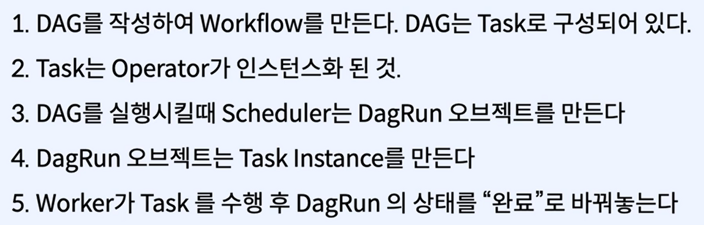

## 3.1.1 Airflow

- 기존 방식의 문제점
    - 실패 복구, 모니터링, 의존성 관리, 확장성, 배포
- 워크플로우 작성, 스케줄링, 모니터링 작업을 프로그래밍할 수 있게 해주는 플랫폼
    - 파이썬, 분산환경 확장성, UI, 커스터마이징 가능
- 워크플로우?
    - 의존성으로 연결된 task들의 집합
    - DAG
- Airflow의 구성
    - 웹 서버: 웹 대시보드 UI
    - 스케줄러: 워크플로우가 **언제** 실행되는지 관리
    - Metastore: 메타데이터 관리
    - Executor: 태스크가 **어떻게** 실행되는지 정의
    - Worker: 테스크를 **실행**하는 프로세스
- DAG(Directed Acyclic Graph)
    - 1 → 2 → 3: 방향성이 있고 순환하지 않는 구조
    - 무한정 순환되는 프로세스가 아님
    - 의존성 관리
- **Operator**: 작업을 정의하는 데 사용
    - Action: 실제 연산을 수행
    - Transfer: 데이터를 옮김
    - Sensor: 태스크를 언제 실행시킬지 트리거를 기다림
- 작업(Task)
    - Operator를 실행시키면 Task가 된다
    - Task = Operator Instance
- 데이터 웨어하우스, 머신러닝, 분석, 실험, 데이터 인프라 관리

## 3.1.2 Airflow의 구조

- One Node Architecture: 하나의 서버에서 실행
    - 웹서버, 스케줄러, 메타스토어, 익스큐터
    - 메타스토어가 DAG정보를 가지고 있어, 웹서버와 스케줄러가 읽어옴
    - 익스큐터로 해당 정보를 보내서 실행
    - 실행된 상태를 메타스토어에 보내서 업데이트
- Multi Node Architecture: 분산환경에서 실행
- One Node와 Multi Node의 차이점: Queue(Celery Broker)의 존재 위치
    - multi node에서는 queue가 executor 바깥에 존재
- 동작 방식
    
    
    
- DAG의 생성과 실행
    1. 유저가 새로운 DAG를 작성 후 Folder DAGs 안에 배치
    2. web server와 scheduler가 DAG를 파싱
    3. scheduler가 metastore를 통해 DAGRun 오브젝트 생성
        1. DAGRun은 사용자가 작성한 DAG의 인스턴스
        2. DAGRun status: Running
    4. scheduler가 task instance 오브젝트를 스케줄링
    5. task instance를 executor로 보냄
    6. 완료 후 executor는 metastore에 완료 보고
    7. scheduler는 DAG실행이 완료됐나 확인
        1. DAGRun Status: completed
    8. UI 업데이트
    

## 3.1.3 Airflow 설치

- 로컬 내 airlow 설치

```bash
pip --version   # Anaconda3 내 파일 경로 확인
pip install apache-airflow   # airflow 설치
airflow  # 설치 확인
cd airflow
ls # home/airflow 경로 확인
airflow db init   # db 연결
airflow webserver -p 8080  # 로컬 호스트 연결   # localhost:8080
airflow users create --role Admin --username admin --email admin \
--firstname admin --lastname admin --password admin   # id/pw 설정
# localhost:8080 로그인 가능
```

- docker-compose를 통한 airflow 설치

```bash
# docker compose download
curl -LfO 'https://airflow.apache.org/docs/apache-airflow/2.3.3/docker-compose.yaml'

# db 초기화: docker-compose.yaml이 위치한 디렉토리 내 실행
docker-compose up airflow-init

# airflow 서비스 실행
docker-compose up
docker ps  # 실행되는 컨테이너 확인
```

## 3.2 데이터 파이프라인 구축

```python
from datetime import datetime
import json
from airflow import DAG
# from airflow.providers.sqlite.operators.sqlite import SqliteOperator
from airflow.operators.postgres_operator import PostgresOperator
from airflow.providers.http.sensors.http import HttpSensor
from airflow.providers.http.operators.http import SimpleHttpOperator
from airflow.operators.python import PythonOperator #유일한 내장 operator
from airflow.operators.bash import BashOperator
from pandas import json_normalize #json to pandas

default_args = {
    'start_date': datetime(2021,1,1), # dag 시작하는 기준
}

def _processing_nft(ti):  # data passing, ti = task instance
    assets = ti.xcom_pull(task_ids=['extract_nft']) # xcom_pull: 특정 task id에서 데이터를 pull 해옴
    if not len(assets):
        raise ValueError("assets is empty")
    nft = assets[0]['assets'][0]   # opensea api 내 nft assets json 인덱싱

    processed_nft = json_normalize({  # convert json to pandas object
        'token_id': nft['token_id'],
        'name': nft['name'],
        'image_url': nft['image_url'],
    })
    processed_nft.to_csv('/tmp/processed_nft.csv', index=None, header=False)

with DAG(dag_id='nft-pipeline',
        schedule_interval = '@daily',
        default_args = default_args,
        tags = ['nft'],
        catchup = False) as dag:
  
  # 01. 테이블 생성
  creating_table = PostgresOperator(
    task_id = 'creating_table',
    postgres_conn_id ='db_postgre',  # db connection id
    sql='''
      CREATE TABLE IF NOT EXIXTS nfts (
        token_id TEXT PRIMARY KEY,
        name TEXT NOT NULL,
        image_url TEXT NOT NULL
      )
    '''
  )
  
  # 02. API 체크(sensor api)
  is_api_available = HttpSensor(   # HTTP로 통신하는 객체 만들기
    task_id = 'is_api_available',
    http_conn_id = 'opensea_api', # DB처럼 Airflow UI 상에 connection 만들어주어야 함 : 외부 통신 
    endpoint = 'api/v1/assets?collection=doodles-official&limit=1'
  )

  # 03. 데이터 불러오기 - Http
  extract_ntf = SimpleHttpOperator(
    task_id = 'extract_nft',   # 연결 생성한 api통신정보 그대로
    http_conn_id = 'opensea_api',
    endpoint = 'api/v1/assets?collection=doodles-official&limit=1',
    method = 'GET',  # api 가져오는 방식
    response_filter = lambda res: json.loads(res.text),   # response 결과: json to python 
    log_response=True  # 로그 찍기
  )

  # 04. 데이터 가공하기: PythonOperator
  process_nft = PythonOperator(
    task_id = 'process_nft',
    python_callable = _processing_nft # function
  )

  # 05. 데이터 저장하기: BashOperator
  store_nft = BashOperator(
    task_id = 'store_nft',
    # bash_command: commandline 처럼 bash 실행
    # bash_command = 'echo -e ".separator ","\n.import /tmp/processed_nft.csv nfts" | sqlite3 /Users/10590/.docker/airflow.db' # sqlit3 -> postgre & db directory 수정 필요
    bash_command = 'echo -e ".separator ","\n.import /tmp/processed_nft.csv nfts" | postgre /Users/10590/.docker/airflow.db' # comma 기준으로 separate해서 nfts 테이블에 저장(import)
  )
  
  # 태스크 간 의존성 연결해주기(UI 확인 가능)
  creating_table >> is_api_available >> extract_ntf >> process_nft >> store_nft
```

```bash
# container 중지
docker stop $(docker ps -a -q)

# TASK 1: 테이블 생성
docker-compose run airflow-worker airflow tasks test nft-pipeline creating_table 2023-01-01

# TASK 2: http api 통신 확인
docker-compose run airflow-worker airflow tasks test nft-pipeline is_api_available

# TASK 3: api로 데이터 가져오기(json)
docker-compose run airflow-worker airflow tasks test nft-pipeline extract_nft 2023-01-01

# TASK 4: 데이터 가공하기(json to pandas)
docker-compose run airflow-worker airflow tasks test nft-pipeline process_nft 2023-01-01

# 불러온 데이터 확인(csv)
cat /tmp/processed_nft.csv

# TASK 5: 데이터 저장하기(to db table)
docker-compose run airflow-worker airflow tasks test nft-pipeline store_nft 2023-01-01
```

- **Backfill**
    -